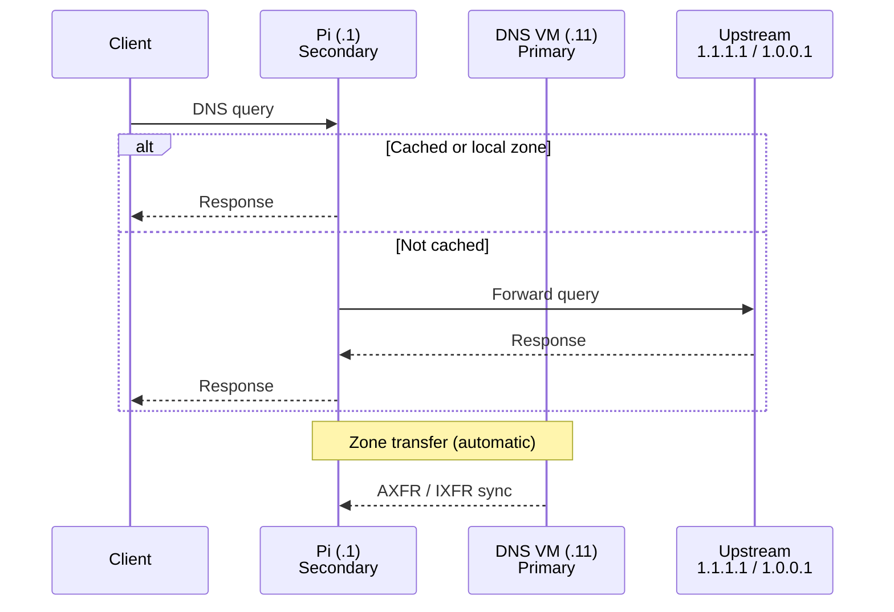

---
tags:
  - architecture
  - network
  - dns
  - vlan
---

# Network & DNS

## VLAN Structure

| VLAN | Purpose |
|---|---|
| Clients | Workstations, laptops, phones |
| IoT | Smart home devices, isolated from clients |
| Homelab | All servers — `172.16.20.0/24` |

All inter-VLAN routing and firewall rules are managed on the UDM SE.

<iframe
  src="../network-topology.html"
  style="width:100%;border:none;border-radius:6px;"
  title="Network topology">
</iframe>

## DNS — Technitium

**Primary zone authority:** DNS VM (`.11`) — all DNS zones and blocklists are configured here. This is the source of truth.

**Secondary (replication):** Raspberry Pi (`.1`) — receives zones via Technitium's built-in zone transfer from `.11`. Zone data always flows DNS VM -> Pi.

**Client resolver order:** DHCP hands out `.1` (Pi) as the primary resolver and `.11` (DNS VM) as the secondary. Clients query the Pi first to distribute load away from the DNS VM; both nodes serve identical zone data.

!!! warning "Zone transfer direction"
    Zone data always flows **DNS VM (.11) -> Pi (.1)**, never the reverse. The DNS VM is the single configuration point. Edit zones there; the Pi is always in sync via automatic zone transfer.

### DNS Resolution Flow

- Single configuration point on the DNS VM; the Pi is always in sync via zone transfer
- Technitium REST API enables Ansible to manage zones declaratively
- Ad blocking built in (equivalent to Pi-hole)

## NTP — chrony

chrony runs on both the Pi (`.1`) and DNS VM (`.11`), upstream to `pool.ntp.org`. All other hosts on the VLAN can use either node as an NTP source.
