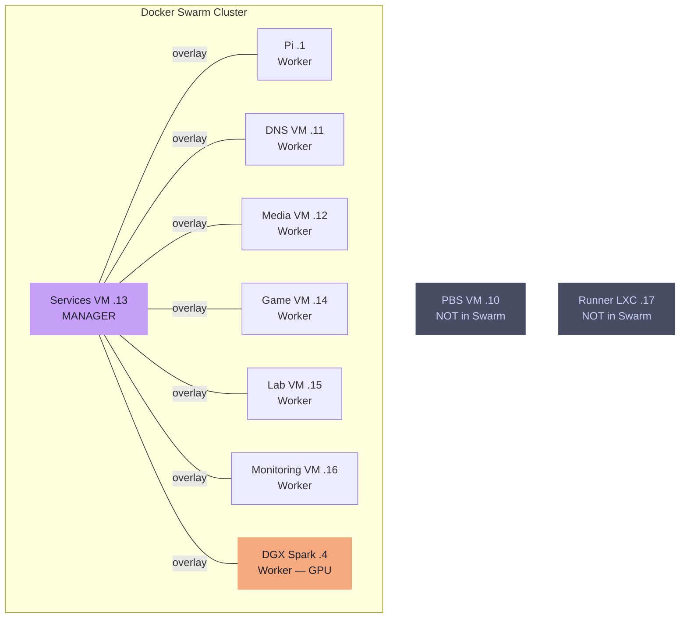

---
tags:
  - architecture
  - proxmox
  - swarm
  - vms
---

# VMs & Swarm

All VMs are provisioned via the Packer -> OpenTofu -> Ansible pipeline.

## Proxmox VM Layout

| VM | IP | In Swarm | Purpose |
|---|---|---|---|
| PBS VM | .10 | No | Proxmox Backup Server — standalone Debian VM |
| DNS/NTP VM | .11 | Worker | Primary Technitium DNS (zone authority), chrony NTP |
| Media VM | .12 | Worker | Plex, *arr stack, download clients |
| Services VM | .13 | **Manager** | Traefik, Paperless, Immich, Authentik, Authelia, N8N, general services |
| Game VM | .14 | Worker | Satisfactory, Netbird, ZeroTier |
| Lab VM | .15 | Worker | Testing, staging, ephemeral workloads |
| Monitoring VM | .16 | Worker | Prometheus, Loki, Grafana, exporters |

## Docker Swarm Topology

### Nodes

| Node | Role | Notes |
|---|---|---|
| Raspberry Pi (.1) | Worker | DNS + NTP only; minimal scheduling |
| DNS/NTP VM (.11) | Worker | DNS + NTP only; minimal scheduling |
| Media VM (.12) | Worker | Media stack pinned here |
| Services VM (.13) | **Manager** | General services pinned here |
| Game VM (.14) | Worker | Game + networking services |
| Lab VM (.15) | Worker | No pinned services; free for testing |
| Monitoring VM (.16) | Worker | Monitoring stack pinned here |
| DGX Spark (.4) | Worker | GPU node; AI/ML stack pinned here |

PBS VM (`.10`) is **not** a Swarm member — standalone Proxmox Backup Server.

!!! tip "Single manager is sufficient"
    The Raft control plane is separate from the data plane: **all running services remain up if the manager reboots**. Management operations are blocked only during that window.

### Service Placement

Services are pinned via `node.hostname == <name>` placement constraints.

=== "Services VM (.13)"

    Traefik, Paperless, paperless-broker (Valkey), Gotenberg, Tika, Immich, Immich ML (CPU), immich-valkey, N8N, reactive-resume, reactive-resume-browserless, Homebox, IT-Tools, Authentik, Authentik-worker, authentik-valkey, Authelia, authelia-valkey

=== "Media VM (.12)"

    Plex, Sabnzbd, Sonarr, Radarr, Prowlarr, qBittorrent, FlareSolverr

=== "DGX Spark (.4)"

    Ollama, OpenWebUI, Langfuse, Qdrant, SearXNG, Cortex stack

=== "Monitoring VM (.16)"

    Prometheus, Loki, Grafana, cAdvisor (global), pve_exporter, truenas-exporter, unifi-poller, Gotify, Uptime Kuma

=== "Game VM (.14)"

    Satisfactory server

=== "DNS nodes (.1, .11)"

    Technitium DNS, chrony NTP

!!! note "Netbird and ZeroTier on Game VM"
    These require `--network host` and kernel-level capabilities incompatible with Swarm's ingress mesh. They run as plain `docker compose` stacks outside Swarm.

!!! note "Valkey (Redis replacement)"
    Valkey is used in place of Redis for all cache and broker instances. Valkey instances are co-located with their service on the Services VM and hold no persistent data.
