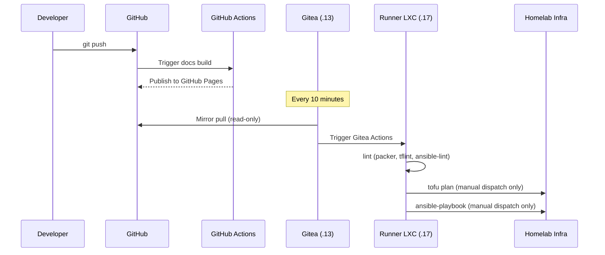

---
tags:
  - automation
  - gitea
  - ci-cd
  - git
---

# CI/CD — Gitea

Local git server and CI/CD runtime for homelab infrastructure pipelines. GitHub remains the primary remote and source of truth for GitHub Pages. Gitea mirrors the repository on a schedule and runs pipelines on every sync — keeping all homelab automation on the homelab network where it has direct access to all infrastructure.

### Mirror & CI Flow

## Components

| Component | Where | Detail |
|---|---|---|
| Gitea app | Services VM (.13) — Swarm service | `gitea.blackcats.cc` via Traefik · TLS auto |
| Gitea data | `tank/media/gitea` NFS -> `/mnt/media/gitea` | Application data — repos, attachments, LFS |
| Gitea DB | Shared Postgres on TrueNAS (.2) | Dedicated `gitea` database, TCP to `172.16.20.2` |
| Mirror | Gitea built-in | Polls GitHub every 10 min · read-only · GitHub stays primary |
| Actions runner | Dedicated Debian LXC at `.17` | `act_runner` binary — not a Swarm service |

`tank/media/gitea` follows the NFS-export tier pattern: `recordsize=128K · compression=zstd · atime=off`.

!!! info "Runner LXC access requirements"
    The runner LXC requires broad network access: SSH to all homelab hosts for Ansible, the Proxmox API for OpenTofu dynamic inventory, and TrueNAS MinIO for OpenTofu state. The SOPS age private key is deployed to the runner by Ansible, allowing it to decrypt secrets at pipeline runtime.

## Pipelines

Workflow files live in `.gitea/workflows/` (GitHub Actions-compatible syntax).

| Trigger | Job | What it does |
|---|---|---|
| Push to `main` | `lint` | `packer validate`, `tflint`, `ansible-lint` |
| Manual dispatch | `plan` | `tofu plan -out=tfplan` — output reviewed before any apply |
| Manual dispatch | `configure` | `ansible-playbook site.yml` — full configuration run |

!!! danger "Apply is never automated"
    `tofu apply` is always run manually after a plan has been reviewed. This matches the `just plan -> just show -> just apply` discipline and guards against accidental destroys in CI.

## Drift Detection

Weekly scheduled Gitea Actions jobs catch infrastructure and configuration drift early. Both are read-only — no changes are applied automatically.

| Job | Command | Report |
|---|---|---|
| Infrastructure drift | `tofu plan` against current state | Gotify notification |
| Configuration drift | `ansible-playbook --check --diff site.yml` | Gotify notification |

Any drift found is reviewed and addressed manually via the normal pipeline.

## Image Pinning Policy

Docker Compose image tags are pinned to **minor semver** (e.g. `traefik:v3.1`, `grafana/grafana:11.2`).

- Do **not** use rolling major tags (e.g. `traefik:v3`) — these change silently on every release
- Do **not** use digest pins — too maintenance-heavy for a homelab

Renovate Bot is configured to propose minor/patch updates per this policy. Existing Compose files using rolling major tags should be updated to the current minor version.
