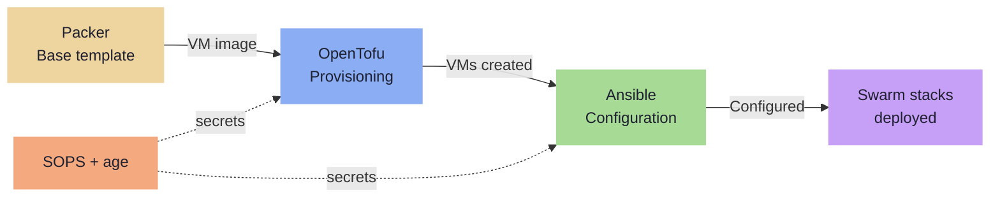
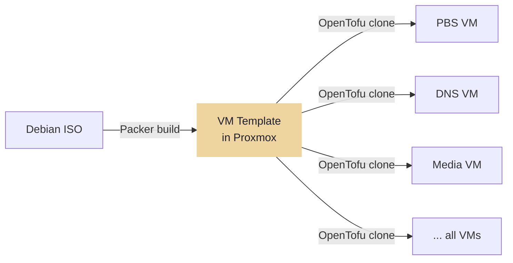
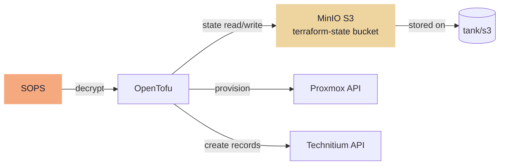
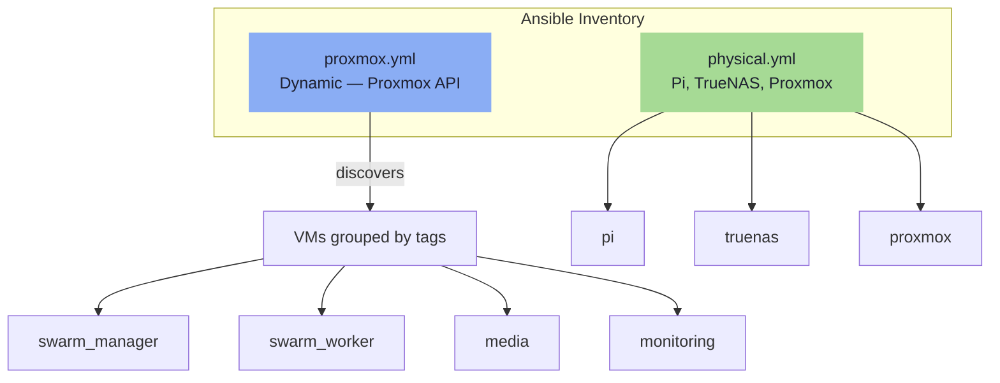

---
tags:
  - automation
  - pipeline
  - packer
  - opentofu
  - ansible
---

# Pipeline

All infrastructure is provisioned and configured declaratively via a three-stage pipeline. Everything lives under `infra/` in the `Homelab` mono-repo.

### Pipeline Flow



**Stages:**

1. **Packer** — builds a Debian base VM template stored in Proxmox
2. **OpenTofu** — provisions VMs from the template; creates DNS records; state in TrueNAS MinIO S3
3. **Ansible** — configures the OS, installs Docker, joins Swarm, deploys stacks, provisions TLS certs

## Repository Structure

```
Homelab/
├── infra/
│   ├── packer/
│   │   └── debian-base.pkr.hcl          # VM template definition
│   ├── terraform/
│   │   ├── main.tf                       # VM resources + DNS records
│   │   ├── variables.tf                  # Input variables
│   │   ├── backend.tf                    # MinIO S3 state backend
│   │   └── secrets.sops.tfvars           # Encrypted credentials
│   └── ansible/
│       ├── inventory/
│       │   ├── physical.yml              # Pi, TrueNAS, Proxmox
│       │   └── proxmox.yml              # Dynamic VM discovery
│       ├── group_vars/all/
│       │   ├── vars.yml                  # Shared variables
│       │   └── secrets.sops.yml          # Encrypted secrets
│       ├── roles/                        # common, docker, truenas, proxmox, pbs
│       └── playbooks/                    # site.yml, vms.yml, certs.yml
├── stacks/                               # Docker Swarm compose files
├── docs/                                 # This documentation site
└── justfile                              # Task runner
```

## justfile Targets

```just
build-template:
    packer build infra/packer/debian-base.pkr.hcl

plan:
    cd infra/terraform && sops exec-env secrets.sops.tfvars 'tofu plan'

apply:
    cd infra/terraform && sops exec-env secrets.sops.tfvars 'tofu apply'

configure:
    ansible-playbook -i infra/ansible/inventory/ infra/ansible/playbooks/site.yml

configure-host host:
    ansible-playbook -i infra/ansible/inventory/ infra/ansible/playbooks/site.yml --limit {{ host }}

deploy-stack stack:
    ansible-playbook -i infra/ansible/inventory/ infra/ansible/playbooks/site.yml --tags stack_{{ stack }}

certs:
    ansible-playbook -i infra/ansible/inventory/ infra/ansible/playbooks/certs.yml

lint:
    packer validate infra/packer/
    cd infra/terraform && tflint
    ansible-lint infra/ansible/
```

---

## Stage 1 — Packer

Packer builds a Debian cloud-init base template stored in Proxmox. Run once per Debian major release, or when base OS configuration changes. All VMs share this template.

```bash
just build-template
# -> packer build infra/packer/debian-base.pkr.hcl
```

The template configures:

- Debian (latest stable) with cloud-init datasource
- SSH key injection via cloud-init user-data
- Base packages: `curl`, `ca-certificates`, `gnupg`, `sudo`
- No Docker — installed by Ansible after provisioning

!!! tip "Template rebuild frequency"
    Templates are built once per Debian major release. Day-to-day OS security updates are applied by Ansible during configuration runs, not by rebuilding the template.



---

## Stage 2 — OpenTofu

OpenTofu provisions VMs from the Packer template: assigns IPs, CPU, RAM, and tags. Also creates DNS A records in Technitium.

```bash
just plan    # -> tofu plan
just apply   # -> tofu apply
```

!!! warning "Apply is always manual"
    `tofu apply` is never automated — not even in CI. The Gitea Actions pipeline runs `tofu plan` only. Apply requires explicit human review and execution via `just apply`.

## State Backend — TrueNAS MinIO

State is stored in the `terraform-state` S3 bucket on TrueNAS MinIO. OpenTofu's S3 backend supports native state locking — no DynamoDB required.

```hcl
# infra/terraform/backend.tf
terraform {
  backend "s3" {
    bucket   = "terraform-state"
    key      = "homelab/terraform.tfstate"
    endpoint = "http://172.16.20.2:9000"
    region   = "us-east-1"

    use_path_style              = true
    skip_credentials_validation = true
    skip_metadata_api_check     = true
    skip_region_validation      = true
  }
}
```

MinIO credentials are injected from the SOPS-encrypted tfvars file or via `AWS_ACCESS_KEY_ID` / `AWS_SECRET_ACCESS_KEY` environment variables.



---

## Stage 3 — Ansible

Ansible configures the OS, installs Docker, joins Swarm workers, deploys Compose stacks, and provisions TLS certificates. Uses a hybrid inventory — physical hosts are static, VMs are discovered dynamically from Proxmox.

```bash
just configure                         # full run
just configure-host host=services      # single host
just deploy-stack stack=media          # redeploy one stack
just certs                             # certificate provisioning only
```

## Hybrid Inventory



=== "Static — physical.yml"

    ```yaml
    all:
      children:
        physical:
          hosts:
            pi:      { ansible_host: 172.16.20.1 }
            truenas: { ansible_host: 172.16.20.2 }
            proxmox: { ansible_host: 172.16.20.3 }
    ```

=== "Dynamic — proxmox.yml"

    ```yaml
    plugin: community.general.proxmox
    url: https://proxmox.blackcats.cc:8006
    user: ansible@pve
    token_id: ansible
    token_secret: "{{ proxmox_api_token }}"
    group_by_tags: true
    want_facts: true
    ```

VMs are grouped by Proxmox tags (`swarm_manager`, `swarm_worker`, `media`, etc.) set by OpenTofu at provisioning time. Ansible group membership is automatic.
