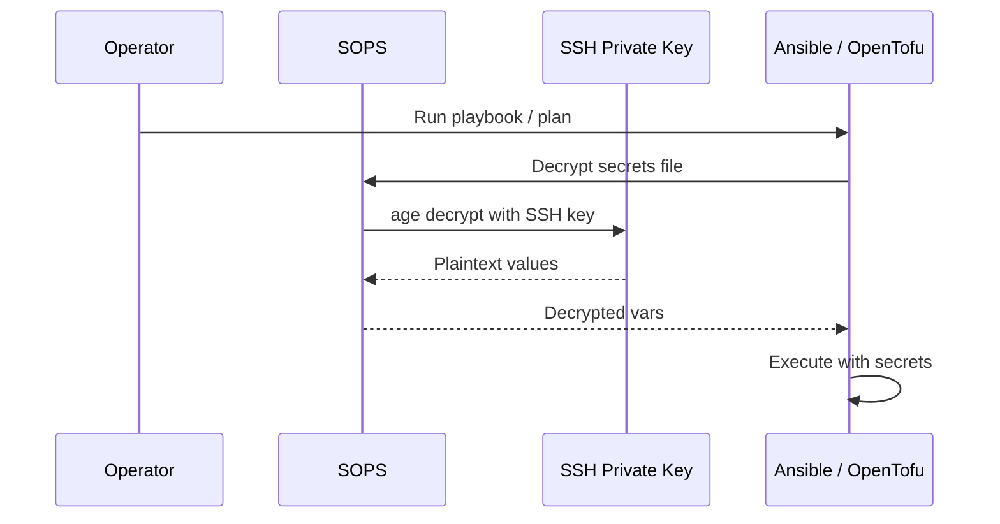

---
tags:
  - automation
  - secrets
  - sops
  - age
---

# Secrets

Secrets are encrypted files committed to git. SOPS encrypts using the operator's SSH public key as the age recipient. A **single SOPS age key** is used for all secrets — no per-function key scoping. Per-function scoping was evaluated and rejected: in a runner-compromise scenario any key the runner holds is exposed regardless of scope, so scoping provides no meaningful blast-radius reduction. A backup/recovery copy of the age key is stored in `tank/backups/keys/` (ZFS-encrypted, no NFS export).

### `.sops.yaml` (repo root)

```yaml
creation_rules:
  - path_regex: .*\.sops\.ya?ml$
    age: >-
      ssh-ed25519 AAAA...yourpublickey,
      age1...recoverykey
  - path_regex: .*\.sops\.tfvars$
    age: >-
      ssh-ed25519 AAAA...yourpublickey,
      age1...recoverykey
```

Both recipients (primary SSH key and recovery age key) can decrypt independently. The recovery key is stored in `tank/backups/keys/` (ZFS-encrypted) with a printed paper copy offline.

### Secret Files

| File | Contents |
|---|---|
| `infra/ansible/group_vars/all/secrets.sops.yml` | Cloudflare API token, DB passwords, Proxmox API token |
| `infra/terraform/secrets.sops.tfvars` | Proxmox API credentials, MinIO access/secret keys |

### Runtime Decryption



```bash
# Ansible: community.sops collection decrypts group_vars automatically
ansible-playbook -i inventory/ playbooks/site.yml

# OpenTofu: pre-decrypt to a process substitution
tofu apply -var-file=<(sops decrypt secrets.sops.tfvars)
```

The SSH private key (primary) is backed up to `tank/backups/keys/` (ZFS-encrypted). In CI, it is injected as a repository secret (`SOPS_AGE_SSH_KEY`).

---

## Credential Rotation

**Cadence:** Annually, or immediately on suspected compromise. No automated rotation — all steps are manual.

**General pattern:** Every rotation follows `generate new → update SOPS → deploy via Ansible → verify → revoke old`. Never revoke the old credential before the new one is deployed and verified.

| Credential | Rotation steps |
|---|---|
| Postgres / MariaDB passwords | Generate new → `sops edit` secrets → `ALTER USER` on TrueNAS → Ansible redeploy affected services |
| Cloudflare API tokens (x4) | One at a time: create new token in Cloudflare → `sops edit` → Ansible deploy → verify cert renewal → revoke old |
| Proxmox API token | New token in Proxmox UI → `sops edit` both files → Ansible deploy to runner → verify `tofu plan` → revoke old |
| MinIO access/secret keys | New key in MinIO → `sops edit` → Ansible redeploy + update Tofu backend → verify → delete old |
| OIDC client secret (Authelia→Authentik) | New secret in Authentik → `sops edit` → Ansible redeploy Authelia |
| SOPS age key (primary) | New SSH key → `sops updatekeys` on all files → commit → Ansible deploy to runner |
| SOPS age key (recovery) | New age key → `sops updatekeys` → store in `tank/backups/keys/` + new paper copy |
| Docker Swarm join tokens | `docker swarm join-token --rotate worker` on manager (.13) → `docker swarm join-token --rotate manager` on manager → update join token in Ansible inventory/vars → rotate after any worker node is decommissioned or rebuilt |

**Post-rotation:** Run the service's health check and confirm no auth errors in Loki.
