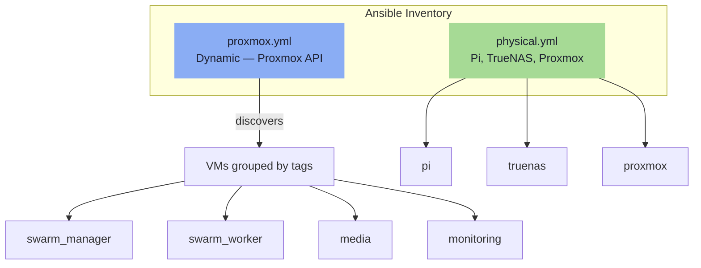
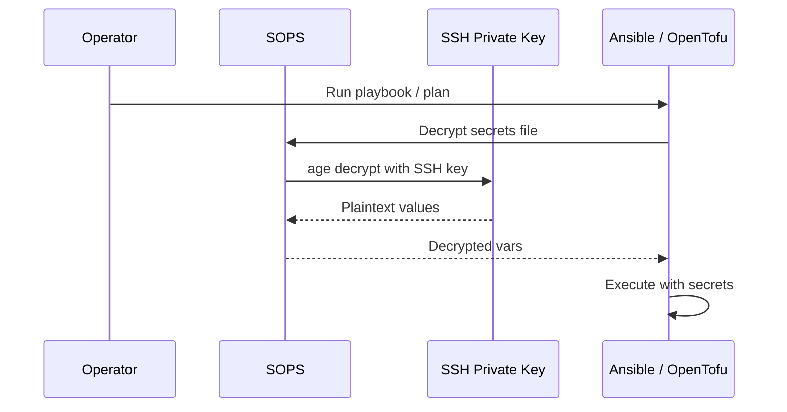

---
tags:
  - iac
  - ansible
  - sops
  - secrets
---

# Ansible — Configuration Management

Ansible configures the OS, installs Docker, joins Swarm workers, deploys Compose stacks, and provisions TLS certificates. Uses a hybrid inventory — physical hosts are static, VMs are discovered dynamically from Proxmox.

```bash
just configure                         # full run
just configure-host host=services      # single host
just deploy-stack stack=media          # redeploy one stack
just certs                             # certificate provisioning only
```

## Hybrid Inventory



=== "Static — physical.yml"

    ```yaml
    all:
      children:
        physical:
          hosts:
            pi:      { ansible_host: 172.16.20.1 }
            truenas: { ansible_host: 172.16.20.2 }
            proxmox: { ansible_host: 172.16.20.3 }
    ```

=== "Dynamic — proxmox.yml"

    ```yaml
    plugin: community.general.proxmox
    url: https://proxmox.blackcats.cc:8006
    user: ansible@pve
    token_id: ansible
    token_secret: "{{ proxmox_api_token }}"
    group_by_tags: true
    want_facts: true
    ```

VMs are grouped by Proxmox tags (`swarm_manager`, `swarm_worker`, `media`, etc.) set by OpenTofu at provisioning time. Ansible group membership is automatic.

## Secret Management — SOPS + age

Secrets are encrypted files committed to git. SOPS encrypts using the operator's SSH public key as the age recipient.

### `.sops.yaml` (repo root)

```yaml
creation_rules:
  - path_regex: .*\.sops\.ya?ml$
    age: ssh-ed25519 AAAA...yourpublickey
  - path_regex: .*\.sops\.tfvars$
    age: ssh-ed25519 AAAA...yourpublickey
```

### Secret Files

| File | Contents |
|---|---|
| `infra/ansible/group_vars/all/secrets.sops.yml` | Cloudflare API token, DB passwords, Proxmox API token |
| `infra/terraform/secrets.sops.tfvars` | Proxmox API credentials, MinIO access/secret keys |

### Runtime Decryption



```bash
# Ansible: community.sops collection decrypts group_vars automatically
ansible-playbook -i inventory/ playbooks/site.yml

# OpenTofu: pre-decrypt to a process substitution
tofu apply -var-file=<(sops decrypt secrets.sops.tfvars)
```

The SSH private key is backed up to `tank/backups/keys/`. In CI, it is injected as a repository secret (`SOPS_AGE_SSH_KEY`).
