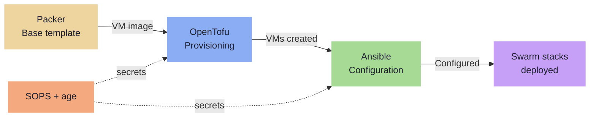

---
tags:
  - iac
  - pipeline
  - packer
  - opentofu
  - ansible
---

# IaC Pipeline Overview

All infrastructure is provisioned and configured declaratively via a three-stage pipeline. Everything lives under `infra/` in the `Homelab` mono-repo.

### Pipeline Flow



**Stages:**

1. **Packer** — builds a Debian base VM template stored in Proxmox
2. **OpenTofu** — provisions VMs from the template; creates DNS records; state in TrueNAS MinIO S3
3. **Ansible** — configures the OS, installs Docker, joins Swarm, deploys stacks, provisions TLS certs

## Repository Structure

```
Homelab/
├── infra/
│   ├── packer/
│   │   └── debian-base.pkr.hcl          # VM template definition
│   ├── terraform/
│   │   ├── main.tf                       # VM resources + DNS records
│   │   ├── variables.tf                  # Input variables
│   │   ├── backend.tf                    # MinIO S3 state backend
│   │   └── secrets.sops.tfvars           # Encrypted credentials
│   └── ansible/
│       ├── inventory/
│       │   ├── physical.yml              # Pi, TrueNAS, Proxmox
│       │   └── proxmox.yml              # Dynamic VM discovery
│       ├── group_vars/all/
│       │   ├── vars.yml                  # Shared variables
│       │   └── secrets.sops.yml          # Encrypted secrets
│       ├── roles/                        # common, docker, truenas, proxmox, pbs
│       └── playbooks/                    # site.yml, vms.yml, certs.yml
├── stacks/                               # Docker Swarm compose files
├── docs/                                 # This documentation site
└── justfile                              # Task runner
```

## justfile Targets

```just
build-template:
    packer build infra/packer/debian-base.pkr.hcl

plan:
    cd infra/terraform && sops exec-env secrets.sops.tfvars 'tofu plan'

apply:
    cd infra/terraform && sops exec-env secrets.sops.tfvars 'tofu apply'

configure:
    ansible-playbook -i infra/ansible/inventory/ infra/ansible/playbooks/site.yml

configure-host host:
    ansible-playbook -i infra/ansible/inventory/ infra/ansible/playbooks/site.yml --limit {{ host }}

deploy-stack stack:
    ansible-playbook -i infra/ansible/inventory/ infra/ansible/playbooks/site.yml --tags stack_{{ stack }}

certs:
    ansible-playbook -i infra/ansible/inventory/ infra/ansible/playbooks/certs.yml

lint:
    packer validate infra/packer/
    cd infra/terraform && tflint
    ansible-lint infra/ansible/
```
