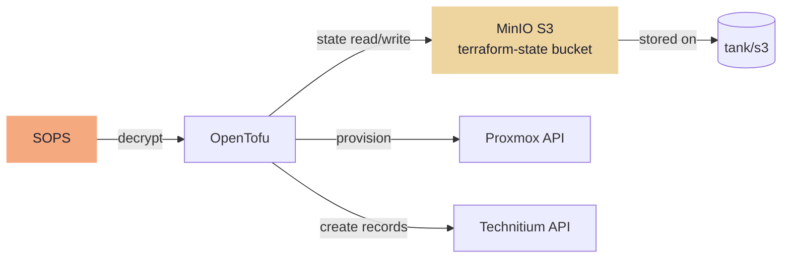

---
tags:
  - iac
  - opentofu
  - terraform
---

# OpenTofu — VM Provisioning

OpenTofu provisions VMs from the Packer template: assigns IPs, CPU, RAM, and tags. Also creates DNS A records in Technitium.

```bash
just plan    # -> tofu plan
just apply   # -> tofu apply
```

!!! warning "Apply is always manual"
    `tofu apply` is never automated — not even in CI. The Gitea Actions pipeline runs `tofu plan` only. Apply requires explicit human review and execution via `just apply`.

## State Backend — TrueNAS MinIO

State is stored in the `terraform-state` S3 bucket on TrueNAS MinIO. OpenTofu's S3 backend supports native state locking — no DynamoDB required.

```hcl
# infra/terraform/backend.tf
terraform {
  backend "s3" {
    bucket   = "terraform-state"
    key      = "homelab/terraform.tfstate"
    endpoint = "http://172.16.20.2:9000"
    region   = "us-east-1"

    use_path_style              = true
    skip_credentials_validation = true
    skip_metadata_api_check     = true
    skip_region_validation      = true
  }
}
```

MinIO credentials are injected from the SOPS-encrypted tfvars file or via `AWS_ACCESS_KEY_ID` / `AWS_SECRET_ACCESS_KEY` environment variables.


