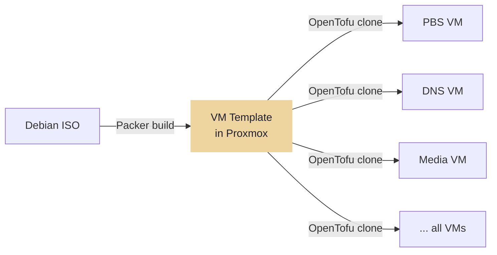

---
tags:
  - iac
  - packer
---

# Packer — Base VM Template

Packer builds a Debian cloud-init base template stored in Proxmox. Run once per Debian major release, or when base OS configuration changes. All VMs share this template.

```bash
just build-template
# -> packer build infra/packer/debian-base.pkr.hcl
```

The template configures:

- Debian (latest stable) with cloud-init datasource
- SSH key injection via cloud-init user-data
- Base packages: `curl`, `ca-certificates`, `gnupg`, `sudo`
- No Docker — installed by Ansible after provisioning

!!! tip "Template rebuild frequency"
    Templates are built once per Debian major release. Day-to-day OS security updates are applied by Ansible during configuration runs, not by rebuilding the template.


