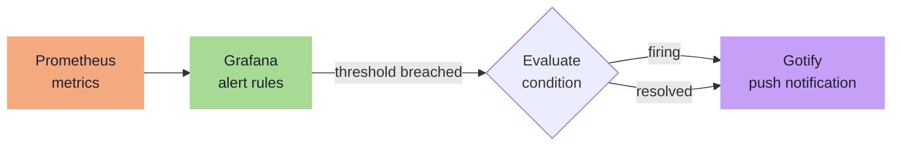

---
tags:
  - operations
  - alerting
  - grafana
  - gotify
  - security
---

# Alerting

Grafana's built-in alerting engine evaluates rules against Prometheus metrics. All notifications are delivered to Gotify via a webhook contact point. No Alertmanager is used.

### Alert Pipeline

## Gotify Contact Point

- **URL:** `http://gotify:80/message` (Swarm overlay DNS)
- **Token:** Gotify app token — stored as a Grafana secret, provisioned by Ansible

!!! warning "Why overlay DNS, not the public domain"
    If the Services VM (.13) goes down, Traefik is unreachable and `gotify.blackcats.cc` fails to resolve usefully. The overlay DNS path routes directly to the Gotify container and works as long as any Swarm node is alive. No secondary alert channel is needed — if .13 is down entirely, the Proxmox host is likely down too.

## Alert Rules

| Alert | Condition | Severity |
|---|---|---|
| Host down | `up == 0` for > 2 min — excludes DGX (WOL-managed, see below) | **Critical** |
| ZFS pool degraded | `truenas_pool_status != healthy` | **Critical** |
| High CPU | Node CPU usage > 90% sustained for 5 min | Warning |
| Low disk | Any mount with < 20% free | Warning |
| Disk spike | Disk usage growing > 5 GB/h on any mount | Warning |
| GPU temp high | `dcgm_gpu_temp > 85C` | Warning |
| Traefik error rate | HTTP 5xx rate > 5% of total requests for 5 min | Warning |
| Authentik login spike | Login failure burst — see Loki rules below | Warning |
| Loki ingestion drop | Loki ingestion rate drops to zero for > 2 min | Warning |

### DGX Spark — WOL alert suppression

DGX (.4) is powered off by default. Its Prometheus targets carry the label `wol_managed: "true"` in `prometheus.yml`. The `up == 0` alert rule excludes targets with this label to prevent spurious critical alerts when DGX is intentionally offline. GPU, disk, and resource alerts remain active for when the host is running.

!!! tip "Provisioning"
    Alert rules are provisioned via Ansible-templated YAML files in Grafana's file-based provisioning directory (`/etc/grafana/provisioning/alerting/`). Files are loaded at container startup — reproducible on rebuild without touching the Grafana UI.

## Key Decisions

| Topic | Decision |
|---|---|
| Alerting engine | Grafana built-in — no Alertmanager |
| Notification target | Gotify webhook via Swarm overlay DNS |
| Rule delivery | File-based provisioning via Ansible |
| DGX host-down alert | Suppressed — WOL-managed host, excluded via `wol_managed` label |
| Dashboard/datasource provisioning | Ansible only — UI-created resources are lost on redeploy |

## Security Alerts (Loki LogQL)

Grafana alerting also evaluates rules against Loki log queries. Authentik and Authelia write auth events to container stdout, which Promtail ships to Loki. SSH failures come from system auth logs.

| Alert | LogQL pattern | Severity |
|---|---|---|
| SSH brute force | `{job="syslog"} \|= "Failed password"` > 10 in 5m per host | Warning |
| Authentik login failure | `{container_name="authentik-server"} \| json \| event="login_failed"` > 5 in 5m | Warning |
| Authentik login failure burst | Same as above, > 20 in 5m | Critical |
| Authelia 1FA failure | `{container_name="authelia"} \|= "Unsuccessful 1FA authentication"` > 5 in 5m | Warning |
| Proxmox API auth failure | `{job="syslog", host="proxmox"} \|= "authentication failure"` | Warning |
| Backup script failure | `{job="syslog", host="services"} \|= "Backup FAILED"` | Critical |
| NFS mount stale | `{job="syslog"} \|= "nfs.*stale"` | Critical |

## Grafana Dashboard Provisioning

All dashboards and data sources must be provisioned by Ansible — never created manually in the Grafana UI. The Monitoring VM is treated as ephemeral; a redeploy will wipe any UI-created resources.

The Ansible `grafana` role provisions:

| Directory | Content |
|---|---|
| `/etc/grafana/provisioning/datasources/` | Prometheus and Loki data sources |
| `/etc/grafana/provisioning/dashboards/` | Dashboard JSON files + discovery config |
| `/etc/grafana/provisioning/alerting/` | All alert rules and contact points |

All config loads at container startup. No manual UI steps are required or permitted.
