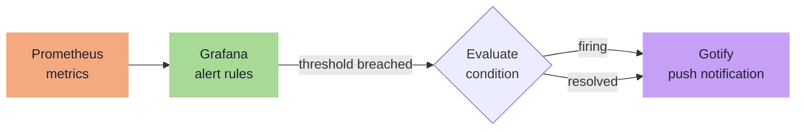

---
tags:
  - operations
  - alerting
  - grafana
  - gotify
  - security
---

# Alerting

Grafana's built-in alerting engine evaluates rules against Prometheus metrics. All notifications are delivered to Gotify via a webhook contact point. No Alertmanager is used.

### Alert Pipeline

## Gotify Contact Point

- **URL:** `http://gotify.blackcats.cc`
- **Token:** Gotify app token — stored as a Grafana secret, provisioned by Ansible

## Alert Rules

| Alert | Condition | Severity |
|---|---|---|
| Host down | `up == 0` for any scrape target for > 2 min | **Critical** |
| ZFS pool degraded | `truenas_pool_status != healthy` | **Critical** |
| High CPU | Node CPU usage > 90% sustained for 5 min | Warning |
| Low disk | Any mount with < 20% free | Warning |
| Disk spike | Disk usage growing > 5 GB/h on any mount | Warning |
| GPU temp high | `dcgm_gpu_temp > 85C` | Warning |

!!! tip "Provisioning"
    Alert rules are provisioned via Ansible-templated YAML files in Grafana's file-based provisioning directory (`/etc/grafana/provisioning/alerting/`). Files are loaded at container startup — reproducible on rebuild without touching the Grafana UI.

## Key Decisions

| Topic | Decision |
|---|---|
| Alerting engine | Grafana built-in — no Alertmanager |
| Notification target | Gotify webhook |
| Rule delivery | File-based provisioning via Ansible |

## Security Alerts (Loki LogQL)

Grafana alerting also evaluates rules against Loki log queries. Authentik and Authelia write auth events to container stdout, which Promtail ships to Loki. SSH failures come from system auth logs.

| Alert | LogQL pattern | Severity |
|---|---|---|
| SSH brute force | `{job="syslog"} \|= "Failed password"` > 10 in 5m per host | Warning |
| Authentik login failure | `{container_name="authentik-server"} \| json \| event="login_failed"` > 5 in 5m | Warning |
| Authentik login failure burst | Same as above, > 20 in 5m | Critical |
| Authelia 1FA failure | `{container_name="authelia"} \|= "Unsuccessful 1FA authentication"` > 5 in 5m | Warning |
| Proxmox API auth failure | `{job="syslog", host="proxmox"} \|= "authentication failure"` | Warning |
| Backup script failure | `{job="syslog", host="services"} \|= "Backup FAILED"` | Critical |
| NFS mount stale | `{job="syslog"} \|= "nfs.*stale"` | Critical |
