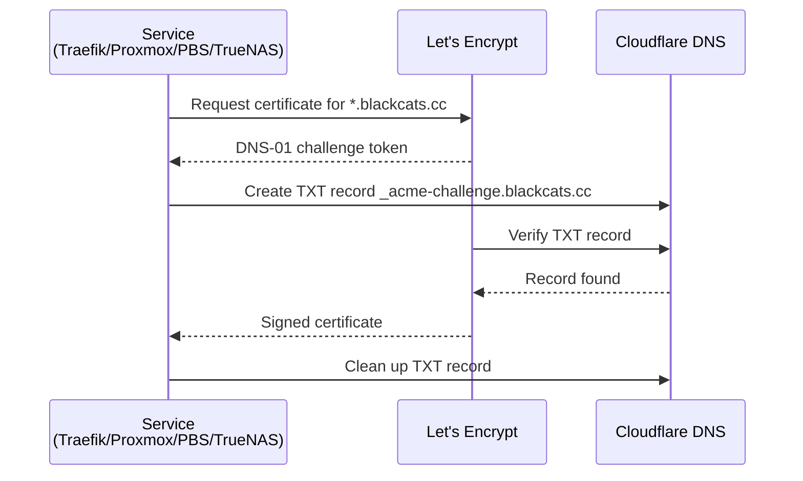

---
tags:
  - operations
  - certificates
  - tls
  - acme
  - cloudflare
---

# Certificate Management

All TLS certificates are obtained from Let's Encrypt using the DNS-01 challenge against the `blackcats.cc` Cloudflare zone. No service needs to be publicly reachable — DNS-01 only requires Cloudflare API access. Each consumer manages its own certificate and renewal independently.

### ACME DNS-01 Flow



## Cloudflare API Token

!!! warning "Single shared token"
    One token is shared by all four consumers. **Scope:** Zone -> DNS -> Edit, restricted to `blackcats.cc`. Traefik receives it as a Docker secret; Proxmox, PBS, and TrueNAS receive it via Ansible.

## Per-Consumer Configuration

=== "Traefik"

    Traefik runs pinned to Services VM (`.13`) and manages one cert per service automatically when a router first activates.

    **Key requirements:**

    - `providers.docker.swarmMode = true` — required to discover services on remote Swarm nodes
    - All labels must be under `deploy: labels:` — top-level labels are invisible to the Swarm API
    - `dnsChallenge.resolvers` must point to `1.1.1.1`, not Technitium (Let's Encrypt validates via public DNS)

    ```yaml
    # traefik.yml
    certificatesResolvers:
      letsencrypt:
        acme:
          email: you@example.com
          storage: /acme/acme.json
          dnsChallenge:
            provider: cloudflare
            resolvers:
              - "1.1.1.1:53"
    ```

    Per-service opt-in:

    ```yaml
    deploy:
      labels:
        - "traefik.enable=true"
        - "traefik.http.routers.myapp.rule=Host(`myapp.blackcats.cc`)"
        - "traefik.http.routers.myapp.tls.certresolver=letsencrypt"
    ```

    `acme.json` lives in a local named volume on Services VM — persists across container restarts.

=== "Proxmox"

    ```bash
    pvenode acme account register default <email> \
      --directory https://acme-v02.api.letsencrypt.org/directory

    pvenode acme plugin add dns cloudflare \
      --api cloudflare \
      --data "CF_Token=<token>"

    pvenode config set --acmedomain0 domain=proxmox.blackcats.cc,plugin=cloudflare
    pvenode acme cert order
    ```

    Auto-renews before expiry. Configured by Ansible during provisioning.

=== "PBS"

    ```bash
    proxmox-backup-manager acme account register default <email> \
      --directory https://acme-v02.api.letsencrypt.org/directory

    proxmox-backup-manager acme plugin add dns cloudflare \
      --api cloudflare \
      --data "CF_Token=<token>"

    proxmox-backup-manager node config update \
      --acmedomain0 domain=pbs.blackcats.cc,plugin=cloudflare
    proxmox-backup-manager acme cert order
    ```

=== "TrueNAS"

    Configured via TrueNAS REST API by Ansible:

    1. `POST /api/v2.0/acme/dns/authenticator` — create Cloudflare authenticator
    2. `POST /api/v2.0/certificate` — create ACME cert
    3. `PUT /api/v2.0/system/general` — set as active GUI certificate

## Summary

| Consumer | Domain | Renewal |
|---|---|---|
| Traefik | `<service>.blackcats.cc` (per router) | Automatic (Traefik) |
| Proxmox | `proxmox.blackcats.cc` | Automatic (Proxmox built-in) |
| PBS | `pbs.blackcats.cc` | Automatic (PBS built-in) |
| TrueNAS | `truenas.blackcats.cc` | Automatic (TrueNAS built-in) |
