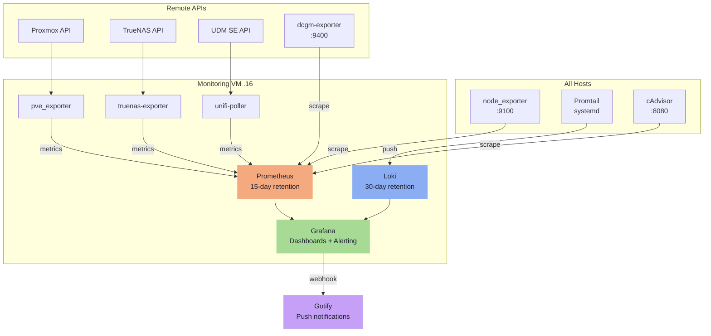

---
tags:
  - operations
  - monitoring
  - prometheus
  - loki
  - grafana
---

# Monitoring

A dedicated Monitoring VM at `172.16.20.16` runs the full PLG stack (Prometheus, Loki, Grafana) as a Swarm worker. Keeping monitoring on a separate failure domain means the stack survives a Services VM outage — the most important property for an observability system. All storage is local to the Monitoring VM; log data is ephemeral.

### Monitoring Data Flow

## Monitoring VM

| Property | Value |
|---|---|
| IP | `172.16.20.16` |
| Hostname | `monitoring` |
| Swarm role | Worker |
| vCPU | 2 |
| RAM | 4 GB |
| Local disk | 40 GB |
| Provisioned by | Packer -> OpenTofu -> Ansible (same pipeline as all other VMs) |

The VM is added to the Swarm as a worker. Grafana is exposed via Traefik on Services VM (`.13`) over the Swarm overlay network — no second Traefik instance required.

**Domain:** `grafana.blackcats.cc`

## Stack Components

All four components run as a single Swarm stack pinned to the Monitoring VM via placement constraints.

| Component | Purpose | Storage |
|---|---|---|
| Prometheus | Metrics scrape + time-series DB | Local named volume — 15-day retention |
| Loki | Log aggregation | Local named volume — 30-day retention (ephemeral) |
| Grafana | Dashboards + alerting rules | Local named volume |
| cAdvisor | Container metrics | No storage — Swarm global service, one per node |

### Volumes

| Volume | Mount path | Approximate size |
|---|---|---|
| `prometheus-data` | `/prometheus` | ~10 GB at homelab scale |
| `loki-data` | `/loki` | ~20 GB headroom |
| `grafana-data` | `/var/lib/grafana` | Dashboards, alert rules, data source config |

All volumes are local to the Monitoring VM — no TrueNAS NFS mounts. Log data is intentionally ephemeral.

!!! info "Why ephemeral logs are acceptable"
    Losing the Monitoring VM loses recent logs, but actual service data lives on TrueNAS and is unaffected. Logs are operational — not archival.

<iframe
  src="monitoring-topology.html"
  style="width:100%;border:none;border-radius:6px;"
  title="Monitoring topology">
</iframe>

---

## Exporters & Log Shipping

## Exporters — All Hosts

Deployed as systemd units by the Ansible `common` role on every host (Pi, TrueNAS, Proxmox, all VMs, DGX Spark):

| Exporter | What it covers |
|---|---|
| `node_exporter` | CPU, RAM, disk, network, hardware temperatures (`--collector.hwmon`) |
| `promtail` | Ships logs to Loki |

=== "DGX Spark only"

    | Exporter | What it covers |
    |---|---|
    | `dcgm-exporter` | GPU temperature, power draw, memory bandwidth, utilisation per GPU |

    `dcgm-exporter` requires NVIDIA driver access and runs directly on the DGX Spark host. Prometheus scrapes it remotely.

=== "Swarm global service"

    | Service | What it covers |
    |---|---|
    | `cAdvisor` | Per-container CPU, memory, and network — mounts Docker socket and cgroups |

=== "Remote API exporters"

    These exporters run as containers pinned to the Monitoring VM. They poll remote APIs and expose Prometheus metrics locally.

    | Exporter | Target | Key metrics |
    |---|---|---|
    | `pve_exporter` | Proxmox API | Per-VM CPU/RAM/disk, host resource usage, storage pool status |
    | `truenas-exporter` | TrueNAS REST API | Pool health, vdev status, dataset usage, ZFS ARC stats, SMART data |
    | `unifi-poller` | UDM SE local API | WAN throughput, switch port traffic and errors, PoE budgets per port, connected client count, AP radio stats, device temperatures |

    !!! note "unifi-poller credentials"
        Requires a read-only local account on the UDM SE. Credentials stored in SOPS-encrypted Ansible secrets.

## Log Shipping — Promtail

Promtail is deployed as a systemd service on every host via Ansible. It tails:

- `/var/log/` — system logs (syslog, auth, kernel)
- Docker container logs via `/var/run/docker.sock` — primary source for all Swarm service logs
- `/var/log/pve/` — Proxmox cluster and task logs (Proxmox host only, labelled `job=pve`)

### Labels Applied to All Log Streams

| Label | Source | Example |
|---|---|---|
| `host` | Hostname | `services`, `proxmox`, `pi` |
| `job` | Log source type | `docker`, `syslog`, `pve` |
| `container_name` | Docker container name | `traefik`, `immich_server` |

Loki retention: 30 days configured via Loki's `retention_period`. Logs are ephemeral — losing the Monitoring VM loses recent logs, which is acceptable.

## Prometheus Scrape Targets

Static scrape targets are defined in `prometheus.yml`, templated by Ansible. No service discovery needed at this scale.

| Job | Targets | Port |
|---|---|---|
| `node` | All hosts (static list) | `9100` |
| `cadvisor` | All Swarm nodes (static list) | `8080` |
| `dcgm` | DGX Spark (`.4`) | `9400` |
| `pve` | pve_exporter on Monitoring VM | `9221` |
| `truenas` | truenas-exporter on Monitoring VM | `9108` |
| `unifi` | unifi-poller on Monitoring VM | `9130` |
