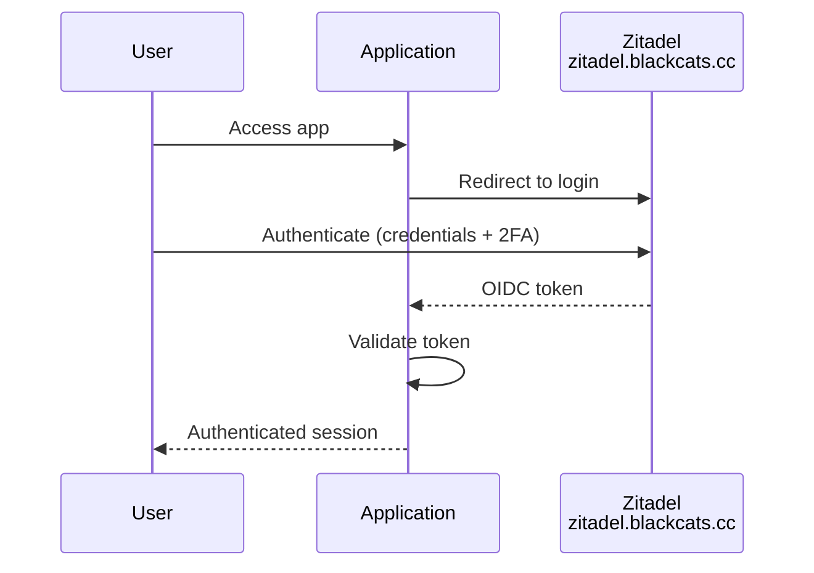
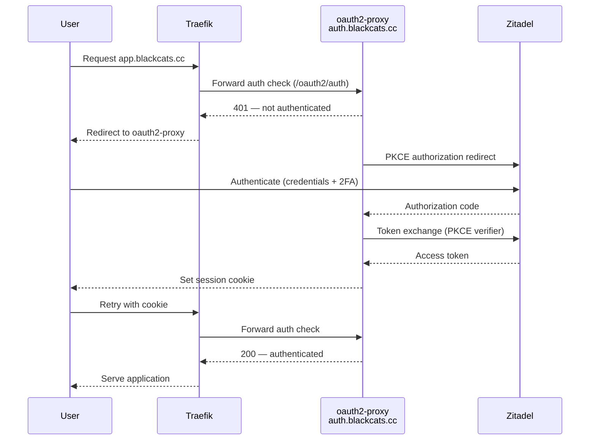
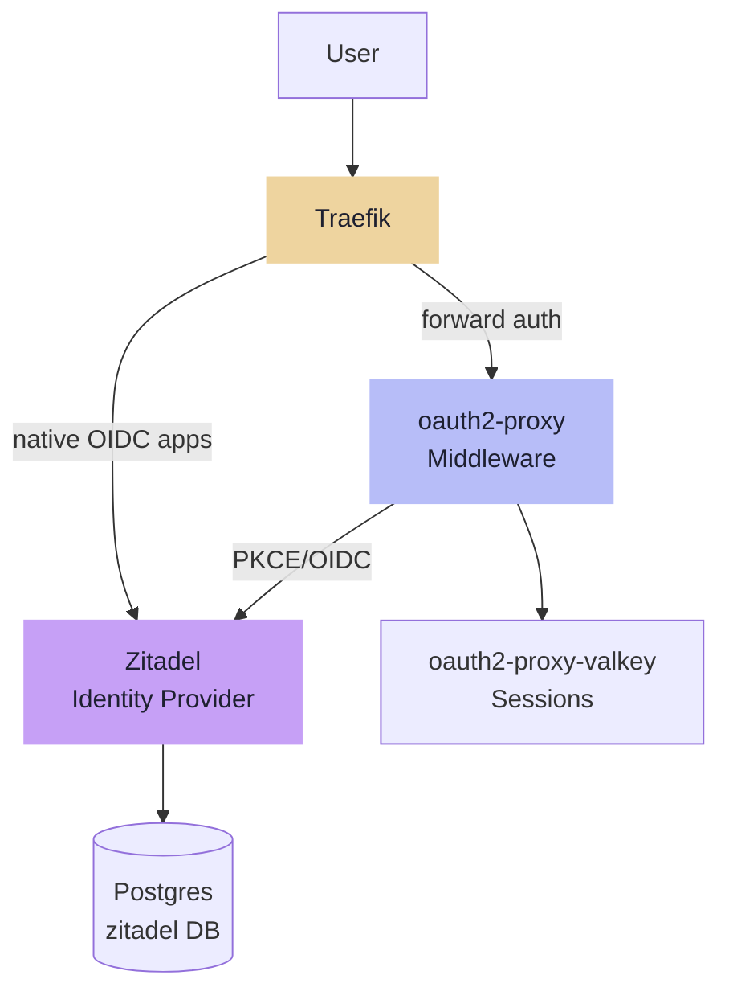

---
tags:
  - operations
  - security
  - sso
  - zitadel
  - oauth2-proxy
  - firewall
---

# Security

## SSO — Zitadel & oauth2-proxy

Zitadel is the single identity provider — all users, credentials, 2FA, and group membership are managed there. oauth2-proxy sits in front of Traefik as a forward auth middleware for services without native OIDC support. It authenticates against Zitadel as a public OIDC client (PKCE, no secret). There is no separate user database — Zitadel is the single source of truth.

## Auth Flows

### Native OIDC

For apps that support it (Grafana, Immich, and others determined per service):

### Traefik Forward Auth

For apps without native OIDC support (*arr stack, etc.):

Single user store throughout. Whether an app uses native OIDC or forward auth is determined at service deployment time based on what the app supports.

## Components

All components run as Swarm services on Services VM (.13).

| Component | Detail |
|---|---|
| Zitadel server | `zitadel.blackcats.cc` via Traefik · TLS auto · Go binary |
| Zitadel login UI | Next.js app (`ghcr.io/zitadel/zitadel-login`) · served at `zitadel.blackcats.cc/ui/v2/login` · reads login-client PAT from shared `zitadel-bootstrap` volume |
| Zitadel DB | Shared Postgres on DB VM (.10) · dedicated `zitadel` database |
| oauth2-proxy | `auth.blackcats.cc` · Traefik forward auth middleware · public OIDC client of Zitadel (PKCE, no secret) · Swarm middleware name `oauth2-proxy@swarm` |
| oauth2-proxy-valkey | Dedicated Valkey · session storage · ephemeral local volume · no password (internal to `auth` overlay only) |
| oauth2-proxy config | TOML managed by Ansible · cookie secret in SOPS |

### Component Relationships

!!! note "oauth2-proxy uses PKCE — no client secret"
    oauth2-proxy is registered as a public OIDC client in Zitadel. The PKCE flow (S256 challenge) replaces the client secret. Only a cookie secret (session encryption) is stored in SOPS.

!!! note "Placement rationale"
    A dedicated auth VM was considered but rejected: Traefik is pinned to Services VM, so forward auth always traverses Services VM regardless. Separating auth adds VM overhead without meaningful resilience gain.

---

## Firewall & Access Control

The homelab VLAN (`172.16.20.0/24`) is a flat trusted network. The VLAN boundary is the security perimeter; inter-VLAN rules on the UDM SE control access from Clients and IoT VLANs.

### Application-Level Access Control (TrueNAS)

| Service | Mechanism | Allowed sources |
|---|---|---|
| Postgres (5432) | `pg_hba.conf` | .13 (Services), .11 (Monitoring), .17 (Runner) |
| MariaDB (3306) | `bind-address` + `GRANT` | .13 (Services) |
| NFS (2049) | `allowed_hosts` per export | .10 (DB/backups), .12 (Media), .13 (Services) |

### Host-Level Firewall (Services VM)

`nftables` managed by Ansible restricts the Swarm manager port:

| Port | Allowed sources |
|---|---|
| 2377 (Swarm manager) | Swarm workers only: .1, .4, .11, .12, .14, .15, .16 |

---

## Incident Response

Lightweight containment checklist for a compromised host or service.

### Immediate Containment

| Step | Action | How |
|---|---|---|
| 1 | **Identify scope** | Check Gotify alerts, Grafana dashboards, Loki logs |
| 2 | **Isolate the host** | `nft add rule inet filter input drop` / `output drop` — or shut down VM via Proxmox |
| 3 | **Preserve logs** | `logcli query '{host="<name>"}' --output=jsonl > incident.jsonl` before 30-day retention expires |
| 4 | **Revoke credentials** | Rotate all credentials the host had access to (see [Secrets — Credential Rotation](../automation/secrets.md#credential-rotation)) |
| 5 | **Notify** | Gotify message with incident summary |

### Recovery

| Step | Action | How |
|---|---|---|
| 6 | **Destroy compromised VM** | `qm destroy <vmid>` — do not attempt to "clean" it |
| 7 | **Rebuild from scratch** | `ansible-playbook site.yml --limit <host>` |
| 8 | **Restore data if needed** | DB: import from daily dump. Files: ZFS snapshot rollback or rclone pull from Filen |
| 9 | **Verify** | Check health checks, review Loki logs on rebuilt host |

### Blast Radius Reference

| Host | Credentials at risk |
|---|---|
| Services VM (.13) | Cloudflare token, OIDC cookie secrets, Zitadel masterkey, Gotify tokens, all Swarm secrets |
| Runner LXC (.17) | **Highest risk** — SOPS age key, SSH to all hosts, Proxmox API, Tofu state DB credentials |
| Synology (.2) | NFS exports (media data), Btrfs snapshots, rclone sync staging |
| DB VM (.10) | Postgres data (all apps), rclone/Filen credentials, backup cron |
| Monitoring VM (.11) | Prometheus targets (read-only), Gotify token, UDM SE read-only account |
| Proxmox (.3) | VM management — physical access to all VMs |
