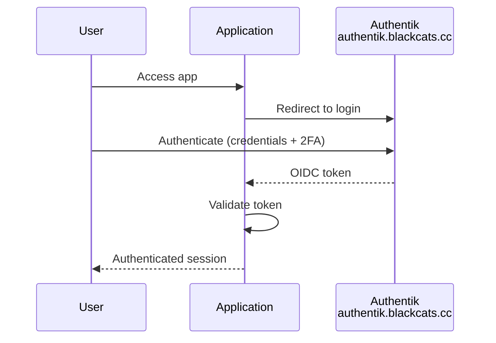
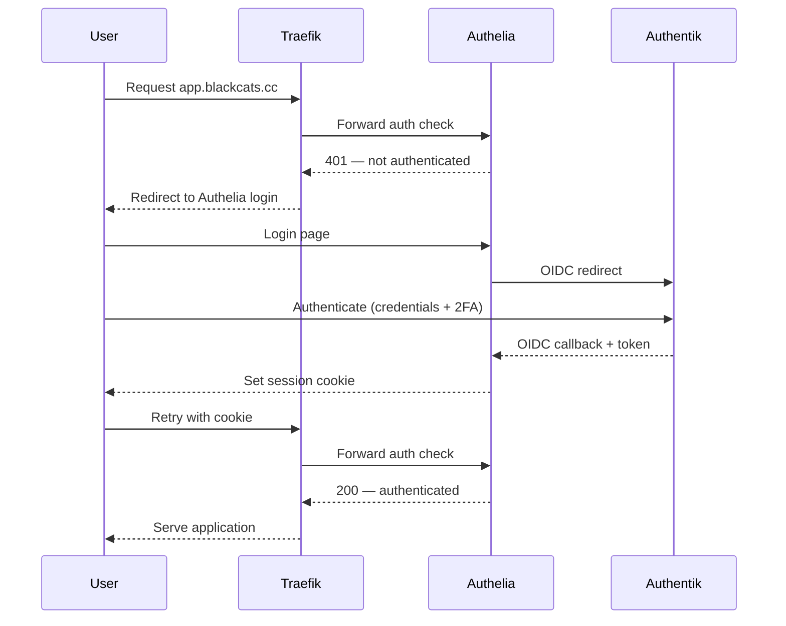
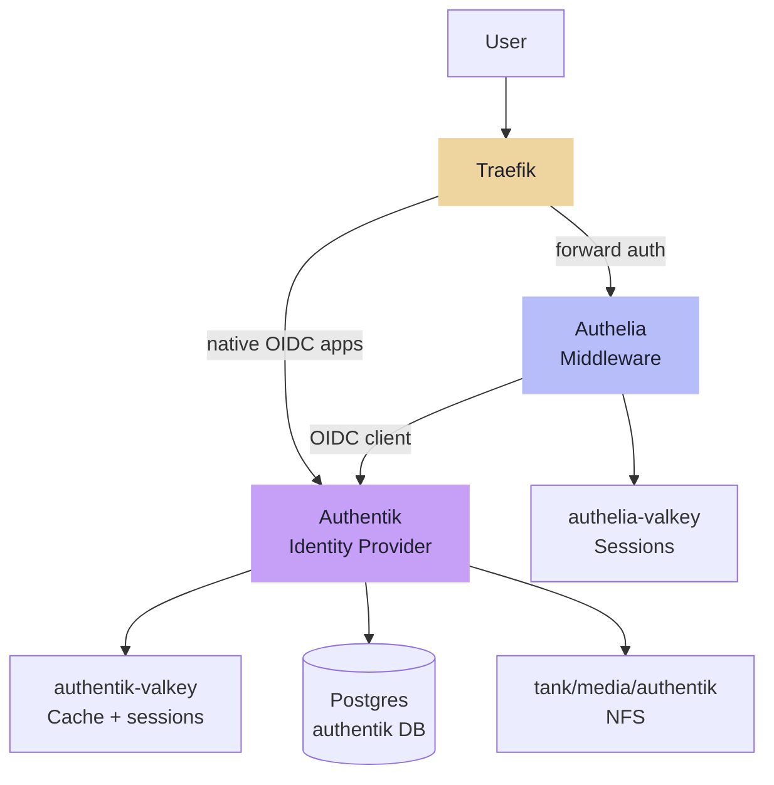

---
tags:
  - operations
  - security
  - sso
  - authentik
  - authelia
  - firewall
---

# Security

## SSO — Authentik & Authelia

Authentik is the single identity provider — all users, credentials, 2FA, and group membership are managed there. Authelia sits in front of Traefik as a forward auth middleware for services that have no native OIDC support, authenticating back to Authentik via OIDC. There is no separate user database in Authelia.

## Auth Flows

### Native OIDC

For apps that support it (Grafana, Immich, and others determined per service):

### Traefik Forward Auth

For apps without native OIDC support:

Single user store throughout. Whether an app uses native OIDC or forward auth is determined at service deployment time based on what the app supports.

## Components

All components run as Swarm services on Services VM (.13).

| Component | Detail |
|---|---|
| Authentik server | `authentik.blackcats.cc` via Traefik · TLS auto |
| Authentik worker | Same image, separate service · background tasks (email, flows, events) |
| authentik-valkey | Dedicated Valkey · cache + sessions · ephemeral local volume |
| Authentik DB | Shared Postgres on TrueNAS (.2) · dedicated `authentik` database |
| Authentik data | `tank/media/authentik` NFS -> `/mnt/media/authentik` · media uploads, custom assets |
| Authelia | Traefik forward auth middleware · OIDC client of Authentik · no own user DB |
| authelia-valkey | Dedicated Valkey · session storage · ephemeral local volume |
| Authelia config | YAML managed by Ansible · no persistent data volume · OIDC client secret in SOPS |

### Component Relationships

!!! note "Authelia has no data volume"
    Config is YAML in git (deployed by Ansible), sessions live in Valkey, and all credentials are stored in Authentik. The OIDC client secret (Authelia registered as a client in Authentik) is encrypted in SOPS.

!!! note "Placement rationale"
    A dedicated auth VM was considered but rejected: Traefik is pinned to Services VM, so forward auth always traverses Services VM regardless. Separating auth adds VM overhead without meaningful resilience gain.

---

## Firewall & Access Control

The homelab VLAN (`172.16.20.0/24`) is a flat trusted network. The VLAN boundary is the security perimeter; inter-VLAN rules on the UDM SE control access from Clients and IoT VLANs.

### Application-Level Access Control (TrueNAS)

| Service | Mechanism | Allowed sources |
|---|---|---|
| Postgres (5432) | `pg_hba.conf` | .13 (Services), .16 (Monitoring), .17 (Runner) |
| MariaDB (3306) | `bind-address` + `GRANT` | .13 (Services) |
| NFS (2049) | `allowed_hosts` per export | .10 (PBS), .12 (Media), .13 (Services) |
| MinIO (9000) | Bucket policies by source IP | .13 (Services), .17 (Runner) |

### Host-Level Firewall (Services VM)

`nftables` managed by Ansible restricts the Swarm manager port:

| Port | Allowed sources |
|---|---|
| 2377 (Swarm manager) | Swarm workers only: .1, .4, .11, .12, .14, .15, .16 |

---

## Incident Response

Lightweight containment checklist for a compromised host or service.

### Immediate Containment

| Step | Action | How |
|---|---|---|
| 1 | **Identify scope** | Check Gotify alerts, Grafana dashboards, Loki logs |
| 2 | **Isolate the host** | `nft add rule inet filter input drop` / `output drop` — or shut down VM via Proxmox |
| 3 | **Preserve logs** | `logcli query '{host="<name>"}' --output=jsonl > incident.jsonl` before 30-day retention expires |
| 4 | **Revoke credentials** | Rotate all credentials the host had access to (see [Secrets — Credential Rotation](../automation/secrets.md#credential-rotation)) |
| 5 | **Notify** | Gotify message with incident summary |

### Recovery

| Step | Action | How |
|---|---|---|
| 6 | **Destroy compromised VM** | `qm destroy <vmid>` — do not attempt to "clean" it |
| 7 | **Rebuild from scratch** | `ansible-playbook site.yml --limit <host>` |
| 8 | **Restore data if needed** | DB: import from daily dump. Files: ZFS snapshot rollback or rclone pull from Filen |
| 9 | **Verify** | Check health checks, review Loki logs on rebuilt host |

### Blast Radius Reference

| Host | Credentials at risk |
|---|---|
| Services VM (.13) | Cloudflare token, OIDC secrets, Valkey passwords, Gotify tokens, all Swarm secrets |
| Runner LXC (.17) | **Highest risk** — SOPS age key, SSH to all hosts, Proxmox API, MinIO keys |
| TrueNAS (.2) | All DB passwords, MinIO keys, NFS exports, ZFS encryption key |
| Monitoring VM (.16) | Prometheus targets (read-only), Gotify token, UDM SE read-only account |
| Proxmox (.3) | VM management, PBS access — physical access to all VMs |
