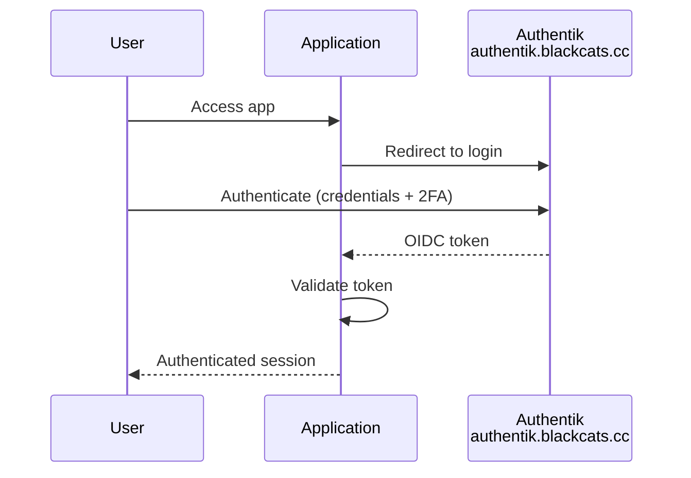
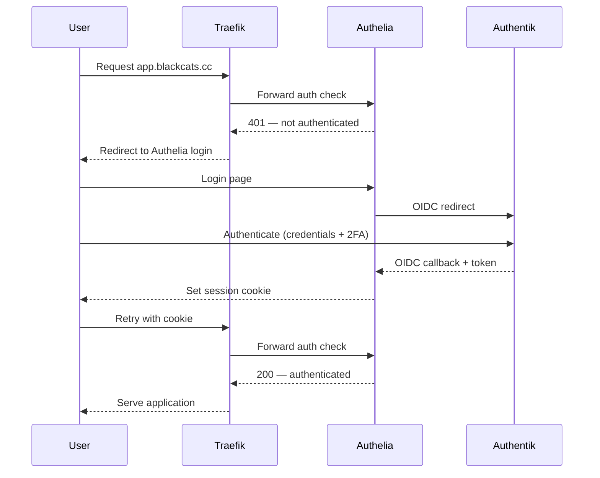
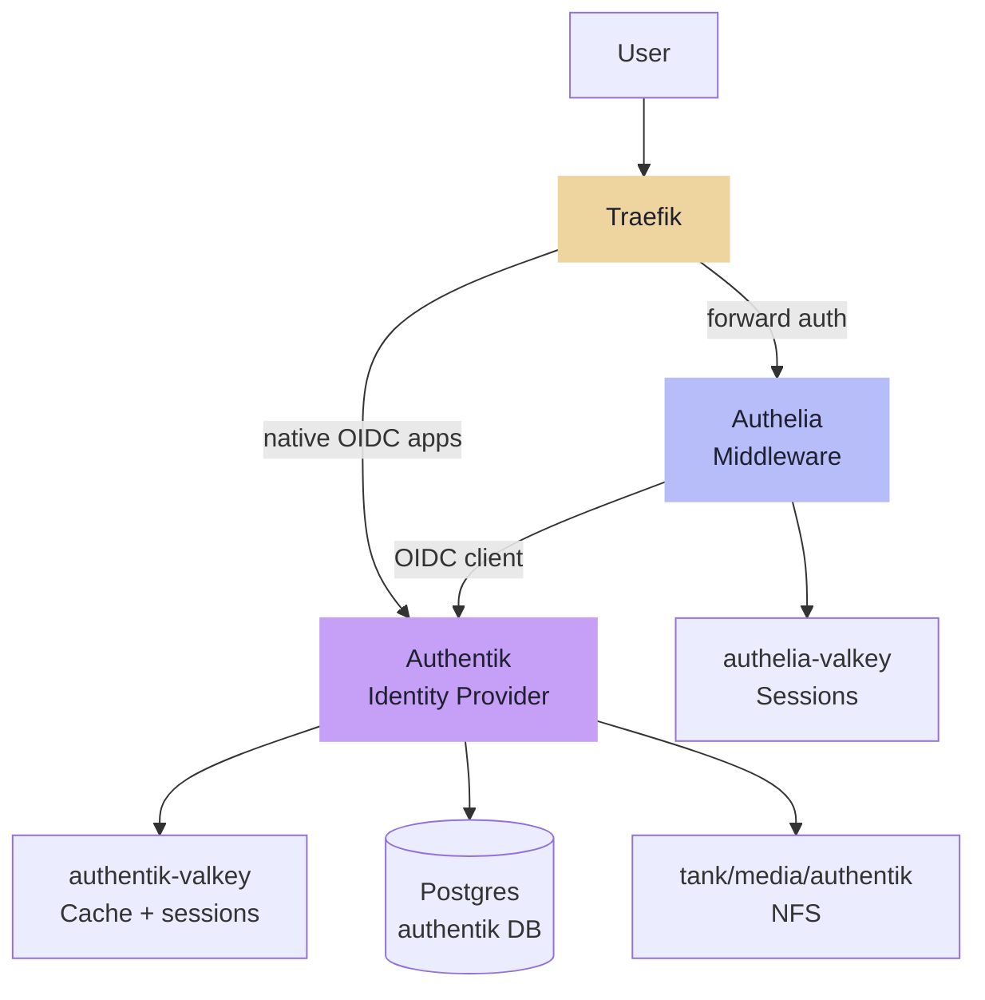

---
tags:
  - sso
  - authentik
  - authelia
  - auth
---

# SSO

Authentik is the single identity provider — all users, credentials, 2FA, and group membership are managed there. Authelia sits in front of Traefik as a forward auth middleware for services that have no native OIDC support, authenticating back to Authentik via OIDC. There is no separate user database in Authelia.

## Auth Flows

### Native OIDC

For apps that support it (Grafana, Immich, and others determined per service):

### Traefik Forward Auth

For apps without native OIDC support:

Single user store throughout. Whether an app uses native OIDC or forward auth is determined at service deployment time based on what the app supports.

## Components

All components run as Swarm services on Services VM (.13).

| Component | Detail |
|---|---|
| Authentik server | `authentik.blackcats.cc` via Traefik · TLS auto |
| Authentik worker | Same image, separate service · background tasks (email, flows, events) |
| authentik-valkey | Dedicated Valkey · cache + sessions · ephemeral local volume |
| Authentik DB | Shared Postgres on TrueNAS (.2) · dedicated `authentik` database |
| Authentik data | `tank/media/authentik` NFS -> `/mnt/media/authentik` · media uploads, custom assets |
| Authelia | Traefik forward auth middleware · OIDC client of Authentik · no own user DB |
| authelia-valkey | Dedicated Valkey · session storage · ephemeral local volume |
| Authelia config | YAML managed by Ansible · no persistent data volume · OIDC client secret in SOPS |

### Component Relationships

!!! note "Authelia has no data volume"
    Config is YAML in git (deployed by Ansible), sessions live in Valkey, and all credentials are stored in Authentik. The OIDC client secret (Authelia registered as a client in Authentik) is encrypted in SOPS.

!!! note "Placement rationale"
    A dedicated auth VM was considered but rejected: Traefik is pinned to Services VM, so forward auth always traverses Services VM regardless. Separating auth adds VM overhead without meaningful resilience gain.
