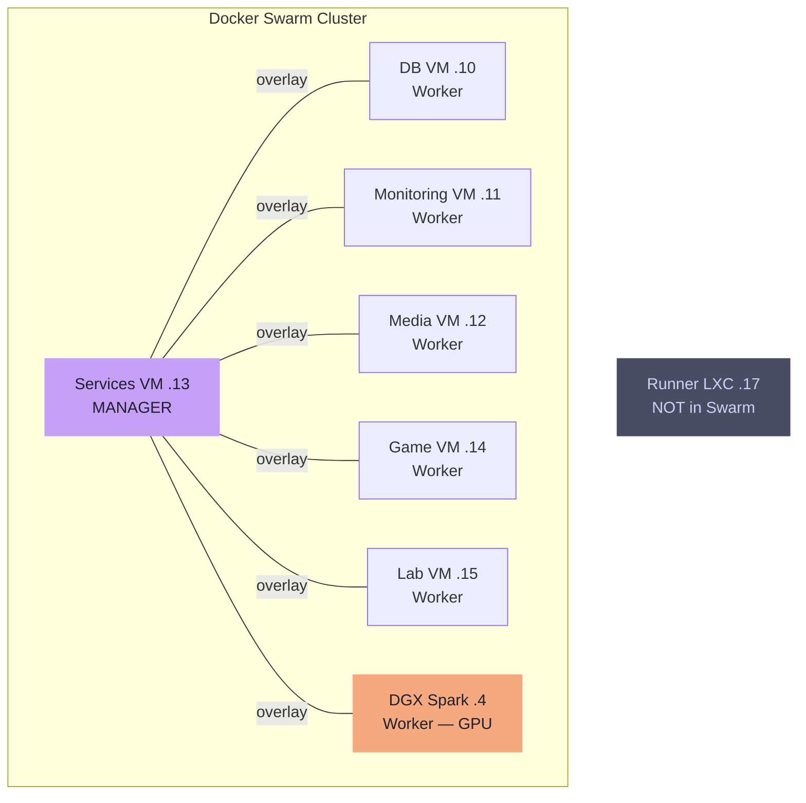

---
tags:
  - stack
  - proxmox
  - swarm
  - compute
---

# VMs & Swarm

All VMs are provisioned via the Packer -> OpenTofu -> Ansible pipeline.

## Proxmox VM Layout

| VM | IP | In Swarm | Purpose |
|---|---|---|---|
| DB VM | .10 | Worker | Postgres, MariaDB, pgadmin, adminer — Swarm services pinned here; backup cron + rclone on host |
| Monitoring VM | .11 | Worker | Prometheus, Loki, Grafana, exporters |
| Media VM | .12 | Worker | Plex, *arr stack, download clients |
| Services VM | .13 | **Manager** | Traefik, Paperless, Immich, Zitadel, oauth2-proxy, general services |
| Game VM | .14 | Worker | Satisfactory, Netbird, ZeroTier |
| Lab VM | .15 | Worker | Testing, staging, ephemeral workloads |

## Docker Swarm Topology

### Nodes

| Node | Role | Notes |
|---|---|---|
| DB VM (.10) | Worker | Database Swarm services pinned here; backup cron on host OS |
| Monitoring VM (.11) | Worker | Monitoring stack pinned here |
| Media VM (.12) | Worker | Media stack pinned here |
| Services VM (.13) | **Manager** | General services pinned here |
| Game VM (.14) | Worker | Game + networking services |
| Lab VM (.15) | Worker | No pinned services; free for testing |
| DGX Spark (.4) | Worker | GPU node; AI/ML stack pinned here; powered off by default, woken via WOL for GPU workloads; alerting suppressed for host-down states |

DB VM (`.10`) is a Swarm worker. Database services (Postgres, MariaDB, pgadmin, adminer) are Swarm services pinned to this node via placement constraint. They join the `db` overlay network — other services connect by service name (e.g. `POSTGRES_HOST=postgres`). The backup cron script runs on the host OS and connects via `127.0.0.1:5432` (mode=host published port).

!!! tip "Single manager is sufficient"
    The Raft control plane is separate from the data plane: **all running services remain up if the manager reboots**. Management operations are blocked only during that window.

!!! note "Swarm viability"
    Docker Swarm is in maintenance mode but remains appropriate at current scale (~20 services). Migration trigger: >50 services, need for CRDs/operators, or Swarm is dropped from Docker Engine.
