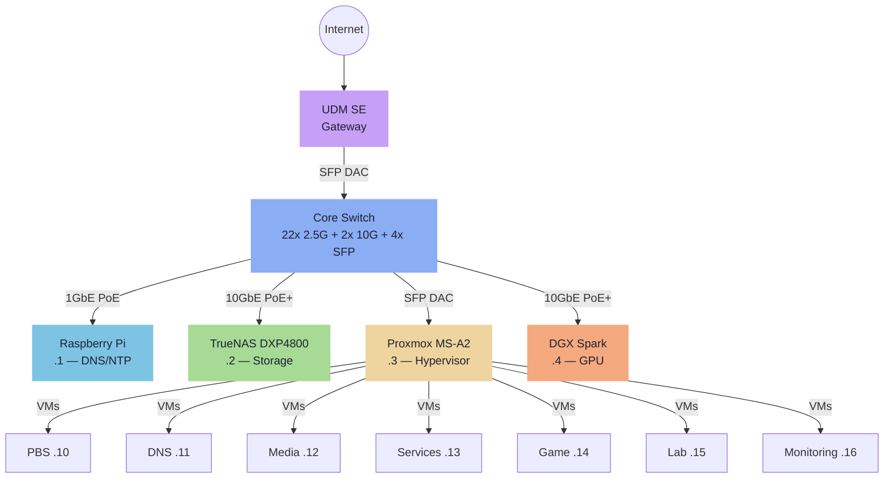

---
tags:
  - stack
  - hardware
  - proxmox
  - overview
---

# The Stack — Overview

A personal homelab that doubles as a production environment for self-hosted services. Every host, VM, and service is provisioned and configured declaratively.

**Design principles:**

- **Infrastructure as Code** — every host, VM, and service provisioned declaratively
- **Network isolation** — VLANs segment traffic; servers live on a dedicated `172.16.20.0/24` subnet
- **Service resilience** — Docker Swarm overlay spans all compute nodes; services are pinned to purpose-built hosts
- **Scalable storage** — TrueNAS is the single storage authority; all persistent data lives on NFS-mounted ZFS datasets

## Physical Hardware

| Device | Role | Connection | IP |
|---|---|---|---|
| UniFi UDM SE | Firewall / Router | WAN + 2x SFP | gateway |
| Core Switch | 22x 2.5Gb PoE+, 2x 10Gb PoE+, 4x SFP | SFP DAC ↔ UDM SE | managed |
| Raspberry Pi 4/5 | Primary DNS + NTP | 1GbE PoE | 172.16.20.1 |
| Ugreen DXP4800 | NAS — TrueNAS SCALE | 10GbE PoE+ | 172.16.20.2 |
| Minisforum MS-A2 | Hypervisor — Proxmox VE | 10Gb SFP DAC | 172.16.20.3 |
| NVIDIA DGX Spark | AI/ML workloads | 10GbE PoE+ | 172.16.20.4 |

!!! info "DGX Spark — WOL-gated"
    The DGX Spark at `.4` is powered on via Wake-on-LAN only when GPU workloads are needed. It participates in Docker Swarm as a worker node but may be offline at any given time.

### Physical Topology

### Switch Port Allocation

| Port type | Used for |
|---|---|
| SFP (1/4) | UDM SE uplink (DAC) |
| SFP (2/4) | Proxmox MS-A2 (DAC) |
| SFP (3-4/4) | Available |
| 10Gb PoE+ (1/2) | TrueNAS DXP4800 |
| 10Gb PoE+ (2/2) | DGX Spark |
| 2.5Gb PoE+ | Raspberry Pi + remaining devices |

## IP Map — 172.16.20.0/24

| Range | Purpose |
|---|---|
| `.1 - .4` | Physical devices |
| `.5 - .9` | Reserved — future physical devices |
| `.10` | PBS VM — not in Swarm |
| `.11` | DNS/NTP VM |
| `.12` | Media VM |
| `.13` | Services VM — Swarm manager |
| `.14` | Game VM |
| `.15` | Lab VM |
| `.16` | Monitoring VM |
| `.17` | Gitea runner LXC |
| `10.0.x.x` | Docker Swarm overlay (internal, not routed) |

<iframe
  src="physical-topology.html"
  style="width:100%;border:none;border-radius:6px;"
  title="Physical network topology">
</iframe>
