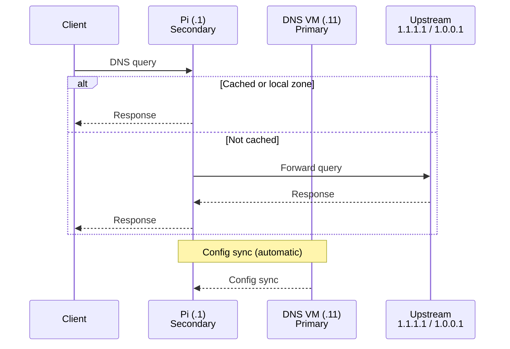

---
tags:
  - stack
  - network
  - dns
  - vlan
  - ntp
---

# Network & DNS

## VLAN Structure

| VLAN | Purpose |
|---|---|
| Clients | Workstations, laptops, phones |
| IoT | Smart home devices, isolated from clients |
| Homelab | All servers — `172.16.20.0/24` |

All inter-VLAN routing and firewall rules are managed on the UDM SE.

<iframe
  src="../network-topology.html"
  style="width:100%;border:none;border-radius:6px;"
  title="Network topology">
</iframe>

## DNS — Technitium

**Primary zone authority:** DNS VM (`.11`) — all DNS zones and blocklists are configured here. This is the source of truth.

**Secondary (replication):** Raspberry Pi (`.1`) — receives zones via Technitium's built-in config sync from `.11`. Zone data always flows DNS VM -> Pi.

**Client resolver order:** DHCP hands out `.1` (Pi) as the primary resolver and `.11` (DNS VM) as the secondary. Clients query the Pi first to distribute load away from the DNS VM; both nodes serve identical zone data.

!!! warning "Replication direction"
    Zone data always flows **DNS VM (.11) -> Pi (.1)**, never the reverse. The DNS VM is the single configuration point. Edit zones there; the Pi is always in sync via Technitium's automatic config sync. This is not a traditional BIND/named zone — SOA serial monitoring is not applicable.

### DNS Resolution Flow

- Single configuration point on the DNS VM; the Pi is always in sync via Technitium config sync
- Technitium REST API enables Ansible to manage zones declaratively
- Ad blocking built in (equivalent to Pi-hole)

## NTP — chrony

chrony runs on both the Pi (`.1`) and DNS VM (`.11`), upstream to `pool.ntp.org`. All other hosts on the VLAN can use either node as an NTP source.

## Host Firewall — nftables

The Services VM (`.13`) has an `nftables` policy (managed by Ansible) that restricts the Swarm manager port (`2377`) to Swarm workers only.

A **default-deny inbound policy** with an explicit allowlist (SSH, `node_exporter`, Promtail, plus per-host overrides) is **planned** for all Proxmox VMs and LXCs. Not yet implemented.

TrueNAS (`.2`) is an appliance OS — access restrictions are enforced at the application level (Postgres `pg_hba.conf`, MariaDB `bind-address`, NFS `allowed_hosts`, MinIO bucket policies) rather than via host firewall.

## Internet Exposure

The homelab has **no inbound internet exposure**. Cloudflare is used solely to obtain valid TLS certificates via DNS-01 ACME challenge.

| Topic | Detail |
|---|---|
| Cloudflare proxy | Disabled — DNS-only mode (grey cloud) on all records |
| DNS A records | Resolve to internal `172.16.20.x` addresses |
| Port forwarding | None on the UDM SE |
| Cloudflare Tunnels | Not deployed; could be added in future |

**Split-horizon DNS:** All public DNS records point to internal IPs. External resolvers return the same `172.16.20.x` addresses, which are unreachable without VPN — no separate internal/external zone management needed.

**External access:**

| Method | Use case |
|---|---|
| Local network | Normal path for all homelab services |
| Netbird | Primary remote access VPN — full VLAN reachability |
| ZeroTier | Gaming with friends (Game VM, `.14`) |
