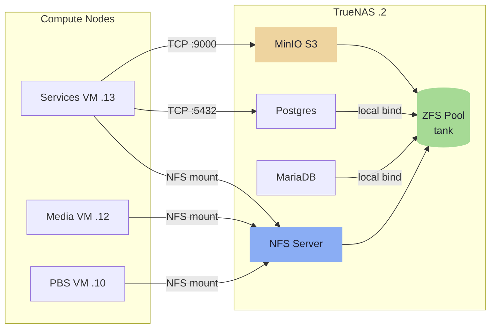
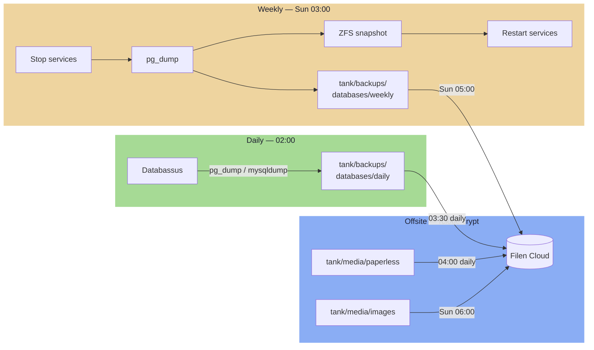

---
tags:
  - stack
  - storage
  - truenas
  - zfs
  - nfs
  - backups
---

# Storage

TrueNAS DXP4800 (`172.16.20.2`, 10GbE) is the single storage authority. Compute nodes mount shares over NFS. Docker config files and ephemeral volumes stay local to each host — only data that must survive a host rebuild lives on TrueNAS.

### Data Flow



## ZFS Dataset Tree

All datasets live under a single pool named `tank`, backed by a RAIDZ pool.

```
tank/
├── media/
│   ├── series          recordsize=1M  · compression=off  · atime=off
│   ├── movies          recordsize=1M  · compression=off  · atime=off
│   ├── downloads       recordsize=1M  · compression=off  · atime=off
│   ├── images          recordsize=128K · compression=lz4  · atime=off   ← Immich
│   ├── paperless       recordsize=128K · compression=zstd · atime=off
│   ├── gitea           recordsize=128K · compression=zstd · atime=off
│   └── authentik       recordsize=128K · compression=zstd · atime=off
│
├── services/                                                            ← For local containers on TrueNAS
│   ├── databases/
│   │   ├── postgres    recordsize=8K  · compression=lz4  · atime=off   ⚠ see note
│   │   ├── mariadb     recordsize=16K · compression=lz4  · atime=off   ⚠ see note
│   │   ├── pgadmin     recordsize=128K · compression=zstd · atime=off
│   │   └── databassus  recordsize=128K · compression=zstd · atime=off
│
├── s3/                 recordsize=1M  · compression=lz4  · atime=off   ← MinIO data
│
├── backups/
│   ├── databases/
│   │   ├── daily/      recordsize=128K · compression=zstd · atime=off  ← Databassus backups
│   │   └── weekly/     recordsize=128K · compression=zstd · atime=off  ← Scripted backups
│   ├── keys/           compression=zstd · ZFS native encryption (AES-256-GCM)
│   ├── pbs/            recordsize=1M  · compression=lz4  · atime=off   ← PBS chunk store
│   └── services/       recordsize=128K · compression=zstd · atime=off  ← File backup
│
└── repos/              recordsize=128K · compression=zstd · atime=off
```

<iframe
  src="storage-diagram.html"
  style="width:100%;border:none;border-radius:6px;"
  title="Storage architecture">
</iframe>

### ZFS Property Rationale

| Property | Value | Why |
|---|---|---|
| `atime=off` | All datasets | Eliminates write-on-read overhead |
| `compression=off` | Video datasets | Already compressed; CPU cost with zero gain |
| `compression=lz4` | Images, DB live, PBS, S3 | Near-zero CPU cost, moderate gain |
| `compression=zstd` | Documents, dumps, configs, repos | Good ratio, worth the CPU |
| `recordsize=1M` | Video, PBS, S3 | Large sequential reads/writes |
| `recordsize=128K` | General files | TrueNAS default; suits mixed workloads |
| `recordsize=8K` | `postgres` | **Must match Postgres page size exactly** |
| `recordsize=16K` | `mariadb` | **Must match InnoDB page size exactly** |

!!! danger "Set at creation time"
    `recordsize` and encryption must be set **at dataset creation time**. They cannot be changed after data is written. Setting these after container initialization has no effect and cannot be corrected without destroying and recreating the dataset.

### `backups/keys` — ZFS Native Encryption

`tank/backups/keys` uses ZFS native encryption (AES-256-GCM). Stores SSH keys, rclone crypt password, and long-lived secrets. No NFS export — accessible on TrueNAS locally only.

## Database Live Data Directories

`tank/services/databases/postgres` and `tank/services/databases/mariadb` hold the **live container data directories**, bind-mounted directly into their respective Docker containers running on TrueNAS (.2). These datasets are **not NFS-exported** — the database engines and their data are co-located on the same host.

!!! warning "Critical constraints for database datasets"
    - `recordsize=8K` for Postgres and `recordsize=16K` for MariaDB must be set **before** the containers first write data
    - ZFS snapshots of live DB data directories are **not crash-consistent while the engine is running** — use `pg_dump` / `mysqldump` into `backups/databases/` instead
    - All Swarm services connecting to a database must use `172.16.20.2` as the host — databases are outside the Swarm overlay network

## NFS Exports

| Dataset | Exported to | Mount point on client |
|---|---|---|
| `tank/media/series` | Media VM (.12) | `/media/series` |
| `tank/media/movies` | Media VM (.12) | `/media/movies` |
| `tank/media/downloads` | Media VM (.12) | `/media/downloads` |
| `tank/media/images` | Services VM (.13) | `/mnt/media/images` |
| `tank/media/paperless` | Services VM (.13) | `/mnt/media/paperless` |
| `tank/media/gitea` | Services VM (.13) | `/mnt/media/gitea` |
| `tank/media/authentik` | Services VM (.13) | `/mnt/media/authentik` |
| `tank/services/databases/*` | **No NFS export** | Local bind mounts on TrueNAS only |
| `tank/backups/pbs` | PBS VM (.10) | `/mnt/datastore` |
| `tank/backups/databases/weekly` | Services VM (.13) | `/mnt/backups/databases/weekly` |
| `tank/backups/services` | Services VM (.13) | `/mnt/backups/services` |
| `tank/repos` | Linux workstation | `~/repos` |
| `tank/backups/keys` | **No NFS export** | Local to TrueNAS only |

NFS options: `sync`, `no_subtree_check`.

!!! tip "NFS-export tier naming"
    New NFS-mounted datasets for Swarm services go under `tank/media/<service>`, not `tank/services/`. The `services/` tier is reserved for containers running directly on TrueNAS.

## Docker Volume Strategy

| Data type | Location | Rationale |
|---|---|---|
| Docker compose files, `.env` | Local host | Config is in git; Ansible restores on rebuild |
| Ephemeral volumes (Valkey, Traefik ACME) | Local host | Intentionally non-persistent |
| Immich photos | `tank/media/images` NFS | Irreplaceable user data |
| Paperless documents | `tank/media/paperless` NFS | Irreplaceable user data |
| Gitea data | `tank/media/gitea` NFS | Application data, mirrors GitHub |
| Authentik media | `tank/media/authentik` NFS | Custom assets, media uploads |
| Postgres data dir | `tank/services/databases/postgres` — local bind mount on TrueNAS | Engine and data co-located; no NFS |
| MariaDB data dir | `tank/services/databases/mariadb` — local bind mount on TrueNAS | Engine and data co-located; no NFS |
| pgadmin / adminer / databassus state | `tank/services/databases/<name>` — local bind mount on TrueNAS | Co-located with engines |
| PBS datastore | `tank/backups/pbs` NFS | PBS manages its own chunk store |
| reactive_resume files | TrueNAS S3 bucket | No SeaweedFS container needed |

---

## S3 / MinIO

TrueNAS SCALE ships with a built-in MinIO app. Enable it under Apps and point its data path at `tank/s3/`.

**Endpoint:** `http://172.16.20.2:9000`

!!! info "Plaintext is acceptable"
    MinIO runs on the internal homelab VLAN (`172.16.20.0/24`) with no external exposure. Plaintext HTTP is acceptable for this use case.

## Buckets

| Bucket | Consumer | Notes |
|---|---|---|
| `reactive-resume` | reactive_resume on Services VM (.13) | Replaces SeaweedFS |
| `terraform-state` | OpenTofu | Remote state backend |
| `loki` | Loki log storage | Future use |

Each service uses a dedicated access key. Keys are stored in SOPS-encrypted Ansible secrets.

!!! note "SeaweedFS eliminated"
    SeaweedFS was originally planned for reactive_resume file storage but was replaced by the existing TrueNAS MinIO instance. This avoids running another distributed storage system for a single consumer — just point reactive_resume at `172.16.20.2:9000` with a dedicated bucket and key.

## reactive_resume Configuration

Remove the SeaweedFS container from the compose stack and set these environment variables on the `reactive_resume` service:

```env
STORAGE_ENDPOINT=172.16.20.2
STORAGE_PORT=9000
STORAGE_REGION=us-east-1
STORAGE_BUCKET=reactive-resume
STORAGE_ACCESS_KEY=<truenas-key>
STORAGE_SECRET_KEY=<truenas-secret>
STORAGE_USE_SSL=false
```

---

## Backups

### Backup Strategy Overview



=== "Daily — Databasus"

    Databasus runs as a Swarm service on Services VM. It connects to Postgres and MariaDB over TCP and writes dumps to `tank/backups/databases/daily/` (NFS-mounted into the container).

    - **Schedule:** 02:00 daily
    - **Retention:** 7 daily dumps
    - **Services stay running** throughout — no downtime

=== "Weekly — Coordinated shutdown"

    Runs every Sunday at 03:00 on Services VM. Stops services, dumps databases, snapshots file datasets, then restarts services.

    ```bash
    # 1. Stop Immich and Paperless
    docker service scale immich_server=0 immich_microservices=0
    docker service scale paperless_webserver=0 paperless_worker=0

    # 2. Dump databases
    pg_dump immich    > /mnt/backups/databases/weekly/immich_$(date +%F).sql
    pg_dump paperless > /mnt/backups/databases/weekly/paperless_$(date +%F).sql

    # 3. ZFS snapshots (instant — downtime = pg_dump duration only)
    ssh truenas "zfs snapshot tank/media/images@weekly-$(date +%F)"
    ssh truenas "zfs snapshot tank/media/paperless@weekly-$(date +%F)"

    # 4. Restart services
    docker service scale immich_server=1 immich_microservices=1
    docker service scale paperless_webserver=1 paperless_worker=1
    ```

    - **Retention:** 4 weekly SQL dumps; 4 ZFS snapshots per dataset
    - **Downtime:** ~1-3 minutes (pg_dump duration)

=== "Offsite — Filen"

    Double-layer encryption: Filen's own E2E encryption plus rclone client-side `crypt` remote.

    ```ini
    [filen]
    type = filen
    email = <filen-account-email>
    password = <filen-master-key>

    [filen-crypt]
    type = crypt
    remote = filen:homelab-backup
    filename_encryption = standard
    directory_name_encryption = true
    password = <rclone-crypt-password>    # stored in tank/backups/keys/
    password2 = <rclone-crypt-salt>       # stored in tank/backups/keys/
    ```

## Offsite Sync Schedule

| Time | Frequency | What |
|---|---|---|
| 03:30 | Daily | `tank/backups/keys/` + `tank/backups/databases/daily/` |
| 04:00 | Daily | `tank/media/paperless/` (incremental) |
| Sun 05:00 | Weekly | `tank/backups/databases/weekly/` + `tank/backups/services/` + `tank/repos/` |
| Sun 06:00 | Weekly | `tank/media/images/` (incremental photo sync) |

### Not Backed Up Offsite

| Dataset | Reason |
|---|---|
| `tank/media/series`, `movies`, `downloads` | Re-downloadable; too large for cloud quota |
| `tank/services/databases/` live dirs | Use dumps — never sync live DB dirs |
| `tank/backups/pbs/` | VM backups too large; PBS is local recovery path |
| `tank/pxe/` | ISOs are re-downloadable |
