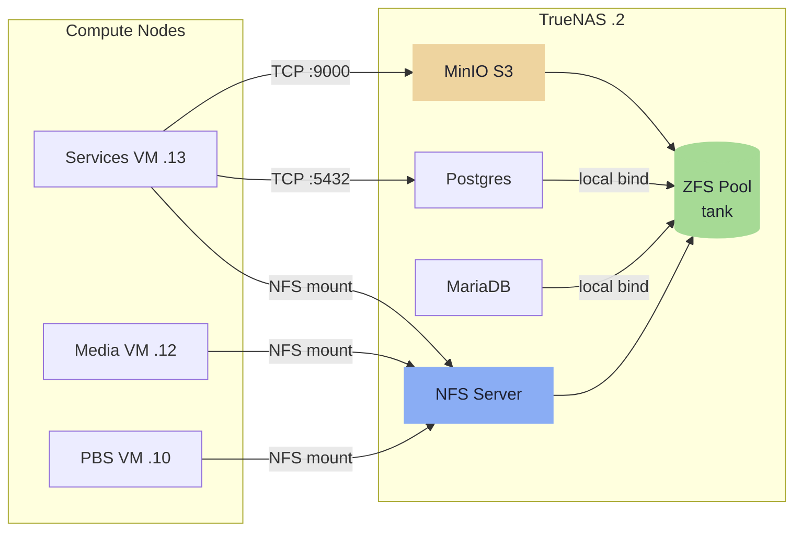
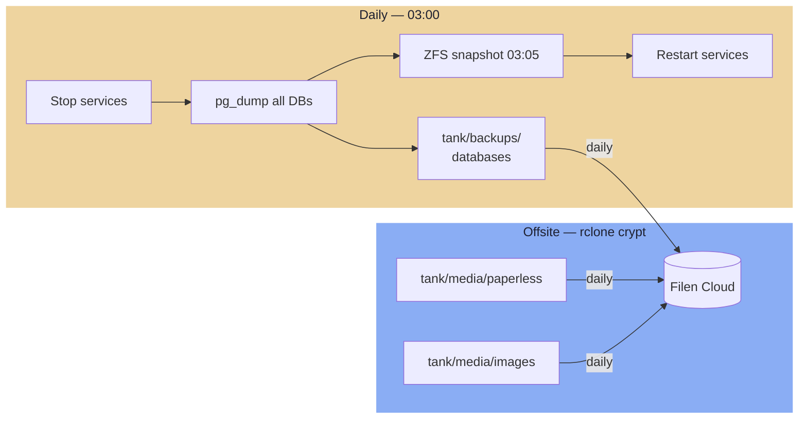

---
tags:
  - stack
  - storage
  - truenas
  - zfs
  - nfs
  - backups
---

# Storage

TrueNAS DXP4800 (`172.16.20.2`, 10GbE) is the single storage authority. Compute nodes mount shares over NFS. Docker config files and ephemeral volumes stay local to each host — only data that must survive a host rebuild lives on TrueNAS.

### Data Flow



## ZFS Dataset Tree

All datasets live under a single pool named `tank`, backed by a RAIDZ pool.

```
tank/
├── media/
│   ├── series          recordsize=1M  · compression=off  · atime=off
│   ├── movies          recordsize=1M  · compression=off  · atime=off
│   ├── downloads       recordsize=1M  · compression=off  · atime=off
│   ├── images          recordsize=128K · compression=lz4  · atime=off   ← Immich
│   ├── paperless       recordsize=128K · compression=zstd · atime=off
│   ├── gitea           recordsize=128K · compression=zstd · atime=off
│   └── authentik       recordsize=128K · compression=zstd · atime=off
│
├── services/                                                            ← For local containers on TrueNAS
│   ├── databases/
│   │   ├── postgres    recordsize=8K  · compression=lz4  · atime=off   ⚠ see note
│   │   ├── mariadb     recordsize=16K · compression=lz4  · atime=off   ⚠ see note
│   │   └── pgadmin     recordsize=128K · compression=zstd · atime=off
│
├── s3/                 recordsize=1M  · compression=lz4  · atime=off   ← MinIO data
│
├── backups/
│   ├── databases/      recordsize=128K · compression=zstd · atime=off  ← Daily pg_dump output (30-day retention)
│   ├── keys/           compression=zstd · ZFS native encryption (AES-256-GCM)
│   ├── pbs/            recordsize=1M  · compression=lz4  · atime=off   ← PBS chunk store
│   └── services/       recordsize=128K · compression=zstd · atime=off  ← File backup
│
└── repos/              recordsize=128K · compression=zstd · atime=off
```

<iframe
  src="../storage-diagram.html"
  style="width:100%;border:none;border-radius:6px;"
  title="Storage architecture">
</iframe>

### ZFS Property Rationale

| Property | Value | Why |
|---|---|---|
| `atime=off` | All datasets | Eliminates write-on-read overhead |
| `compression=off` | Video datasets | Already compressed; CPU cost with zero gain |
| `compression=lz4` | Images, DB live, PBS, S3 | Near-zero CPU cost, moderate gain |
| `compression=zstd` | Documents, dumps, configs, repos | Good ratio, worth the CPU |
| `recordsize=1M` | Video, PBS, S3 | Large sequential reads/writes |
| `recordsize=128K` | General files | TrueNAS default; suits mixed workloads |
| `recordsize=8K` | `postgres` | **Must match Postgres page size exactly** |
| `recordsize=16K` | `mariadb` | **Must match InnoDB page size exactly** |

!!! danger "Set at creation time"
    `recordsize` and encryption must be set **at dataset creation time**. They cannot be changed after data is written. Setting these after container initialization has no effect and cannot be corrected without destroying and recreating the dataset.

### `backups/keys` — ZFS Native Encryption

`tank/backups/keys` uses ZFS native encryption (AES-256-GCM). Stores SSH keys, rclone crypt password, and long-lived secrets. No NFS export — accessible on TrueNAS locally only.

## Database Live Data Directories

`tank/services/databases/postgres` and `tank/services/databases/mariadb` hold the **live container data directories**, bind-mounted directly into their respective Docker containers running on TrueNAS (.2). These datasets are **not NFS-exported** — the database engines and their data are co-located on the same host.

!!! warning "Critical constraints for database datasets"
    - `recordsize=8K` for Postgres and `recordsize=16K` for MariaDB must be set **before** the containers first write data
    - ZFS snapshots of live DB data directories are **not crash-consistent while the engine is running** — use `pg_dump` / `mysqldump` into `backups/databases/` instead
    - All Swarm services connecting to a database must use `172.16.20.2` as the host — databases are outside the Swarm overlay network

## NFS Exports

| Dataset | Exported to | Mount point on client |
|---|---|---|
| `tank/media/series` | Media VM (.12) | `/media/series` |
| `tank/media/movies` | Media VM (.12) | `/media/movies` |
| `tank/media/downloads` | Media VM (.12) | `/media/downloads` |
| `tank/media/images` | Services VM (.13) | `/mnt/media/images` |
| `tank/media/paperless` | Services VM (.13) | `/mnt/media/paperless` |
| `tank/media/gitea` | Services VM (.13) | `/mnt/media/gitea` |
| `tank/media/authentik` | Services VM (.13) | `/mnt/media/authentik` |
| `tank/services/databases/*` | **No NFS export** | Local bind mounts on TrueNAS only |
| `tank/backups/pbs` | PBS VM (.10) | `/mnt/datastore` |
| `tank/backups/databases` | Services VM (.13) | `/mnt/backups/databases` |
| `tank/backups/services` | Services VM (.13) | `/mnt/backups/services` |
| `tank/repos` | Linux workstation | `~/repos` |
| `tank/backups/keys` | **No NFS export** | Local to TrueNAS only |

NFS options: `sync`, `no_subtree_check`.

!!! info "NFS encryption"
    NFS traffic is cleartext; accepted risk on a private VLAN with VPN-gated access (Netbird). Mitigated by planned host-level nftables.

!!! info "Postgres TLS"
    Postgres connections are also cleartext on the internal VLAN. Accepted risk: private VLAN, VPN-gated access (Netbird), no external exposure. Mitigated by planned host-level nftables (Postgres port restricted to known client IPs).

!!! tip "NFS-export tier naming"
    New NFS-mounted datasets for Swarm services go under `tank/media/<service>`, not `tank/services/`. The `services/` tier is reserved for containers running directly on TrueNAS.

## Docker Volume Strategy

| Data type | Location | Rationale |
|---|---|---|
| Docker compose files, `.env` | Local host | Config is in git; Ansible restores on rebuild |
| Ephemeral volumes (Valkey, Traefik ACME) | Local host | Intentionally non-persistent |
| Immich photos | `tank/media/images` NFS | Irreplaceable user data |
| Paperless documents | `tank/media/paperless` NFS | Irreplaceable user data |
| Gitea data | `tank/media/gitea` NFS | Application data, mirrors GitHub |
| Authentik media | `tank/media/authentik` NFS | Custom assets, media uploads |
| Postgres data dir | `tank/services/databases/postgres` — local bind mount on TrueNAS | Engine and data co-located; no NFS |
| MariaDB data dir | `tank/services/databases/mariadb` — local bind mount on TrueNAS | Engine and data co-located; no NFS |
| pgadmin / adminer state | `tank/services/databases/<name>` — local bind mount on TrueNAS | Co-located with engines |
| PBS datastore | `tank/backups/pbs` NFS | PBS manages its own chunk store |
| reactive_resume files | TrueNAS S3 bucket | No SeaweedFS container needed |

---

## S3 / MinIO

TrueNAS SCALE ships with a built-in MinIO app. Enable it under Apps and point its data path at `tank/s3/`.

**Endpoint:** `https://truenas.blackcats.cc:9000` (TLS — use the hostname, not the IP; the cert is issued for `truenas.blackcats.cc` and IP access bypasses validation)

## Buckets

| Bucket | Consumer | Notes |
|---|---|---|
| `reactive-resume` | reactive_resume on Services VM (.13) | Replaces SeaweedFS |
| `terraform-state` | OpenTofu | Remote state backend |
| `loki` | Loki log storage | Future use |

Each service uses a dedicated access key. Keys are stored in SOPS-encrypted Ansible secrets.

!!! note "SeaweedFS eliminated"
    SeaweedFS was originally planned for reactive_resume file storage but was replaced by the existing TrueNAS MinIO instance. This avoids running another distributed storage system for a single consumer — just point reactive_resume at `truenas.blackcats.cc:9000` with a dedicated bucket and key.

## reactive_resume Configuration

Remove the SeaweedFS container from the compose stack and set these environment variables on the `reactive_resume` service:

```env
STORAGE_ENDPOINT=truenas.blackcats.cc
STORAGE_PORT=9000
STORAGE_REGION=us-east-1
STORAGE_BUCKET=reactive-resume
STORAGE_ACCESS_KEY=<truenas-key>
STORAGE_SECRET_KEY=<truenas-secret>
STORAGE_USE_SSL=true
```

---

## Backups

### Backup Strategy Overview



A single script runs **daily at 03:00** on TrueNAS (.2). It stops services (via SSH to the Swarm manager at .13), dumps all databases locally, waits for the automated ZFS snapshot at 03:05, restarts services, then syncs offsite via rclone directly from local ZFS snapshot paths. rclone and Filen credentials are deployed to TrueNAS by Ansible.

The script is maintained in the IaC repository. Ansible deploys it to TrueNAS and installs it as a cron job — it is version-controlled, reviewed through normal CI, and updated automatically when Ansible runs.

- **Schedule:** 03:00 daily
- **Runs on:** TrueNAS (.2) — direct local access to ZFS datasets, snapshots, and databases
- **Downtime:** ~2–5 minutes (service stop → dump → snapshot wait → restart)
- **Step 1 — TrueNAS config export:** `GET /api/v2.0/config/save` — exports a tar.gz of the full system config (pool layout, datasets, network, users, credentials, ACME config) to `tank/backups/services/truenas/truenas-config-$(date +%F).tar.gz`, 7-day local retention, synced offsite to Filen. Required for total-loss recovery (Scenario C3/D): without it the correct pool layout cannot be reconstructed before restoring data from Filen.
- **Databases in scope:** `immich`, `paperless`, `gitea`, `authentik`, `freshrss`
- **Retention:** 30 daily SQL dumps in `tank/backups/databases/`
- **Timeout:** 4-hour total limit; on success emits a heartbeat timestamp for Prometheus alerting (alert fires if file is older than 25 hours)

=== "Offsite — Filen"

    Double-layer encryption: Filen's own E2E encryption plus rclone client-side `crypt` remote.

    ```ini
    [filen]
    type = filen
    email = <filen-account-email>
    password = <filen-master-key>

    [filen-crypt]
    type = crypt
    remote = filen:homelab-backup
    filename_encryption = standard
    directory_name_encryption = true
    password = <rclone-crypt-password>    # stored in tank/backups/keys/
    password2 = <rclone-crypt-salt>       # stored in tank/backups/keys/
    ```

## Offsite Sync Schedule

| Time | Frequency | What |
|---|---|---|
| 03:00 | Daily | Services stopped → pg_dump all DBs → ZFS snapshot → restart |
| ~04:00 | Daily | rclone sync: databases, paperless, images, services → Filen |

### Not Backed Up Offsite

| Dataset | Reason |
|---|---|
| `tank/media/series`, `movies`, `downloads` | Re-downloadable; too large for cloud quota |
| `tank/services/databases/` live dirs | Use dumps — never sync live DB dirs |
| `tank/backups/pbs/` | VM backups too large; PBS is local recovery path |
| `tank/pxe/` | ISOs are re-downloadable |
