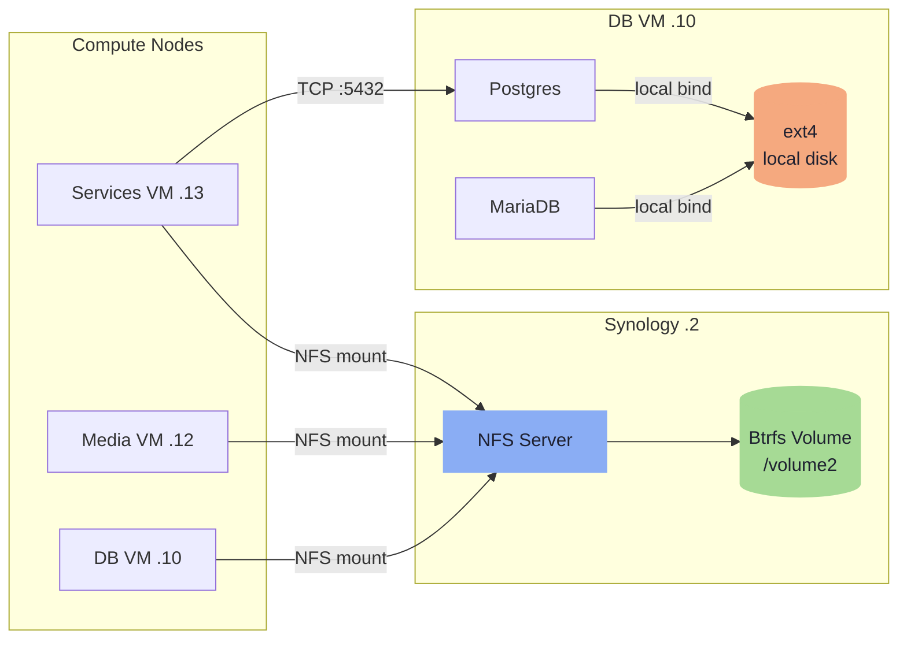
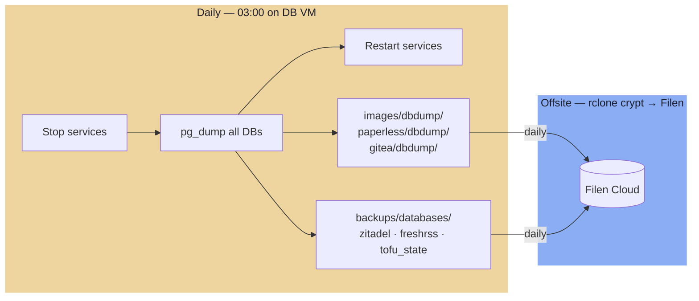

---
tags:
  - stack
  - storage
  - synology
  - btrfs
  - nfs
  - backups
---

# Storage

Synology RS1219+ (`172.16.20.2`, 10GbE) is the NFS storage authority — it handles disks and NFS exports only. Databases run on the dedicated DB VM (`.10`). Compute nodes mount media and application shares over NFS. Docker config and ephemeral volumes stay local to each host.

### Data Flow



## Synology Share Structure

All NFS-exported data lives under two top-level shared folders on `/volume2`.

```
/volume2/
├── Media/
│   ├── Series/         — Video; no backup
│   ├── Series_done/    — Processed video; no backup
│   ├── Movies/         — Video; no backup
│   └── Downloads/      — Transient; no backup
│
├── media/
│   ├── images/         — Immich photos + dbdump/ subdir
│   ├── paperless/      — Documents + dbdump/ subdir
│   └── gitea/          — Git data + dbdump/ subdir
│
└── backups/
    ├── databases/      — zitadel/freshrss/tofu_state dumps (30-day)
    └── services/       — Miscellaneous config backups; heartbeat file
```

`dbdump/` subdirectories inside media shares are created by the backup script. They get synced to Filen along with the application data, so Immich/Paperless/Gitea DB dumps get offsite coverage for free.

!!! tip "NFS-export share naming"
    New NFS-mounted shares for Swarm services go under `/volume2/media/<service>`. The `backups/` tier is reserved for dump output and config archives.

## Database Live Data

Postgres, MariaDB, pgadmin, and adminer run as **Swarm services** pinned to the DB VM (.10) via placement constraint (`node.hostname == db`). Data directories are local ext4 bind mounts — pinning ensures the container always lands on the same data.

!!! warning "Connecting to databases: use overlay DNS, not `172.16.20.10`"
    DB services are on the `db` overlay network. Services that need a database must join that overlay and connect by service name (e.g. `POSTGRES_HOST=postgres`). The backup script on the host OS uses `127.0.0.1:5432` via a `mode=host` published port.

## NFS Exports

| Synology path | Exported to | Mount point on client |
|---|---|---|
| `/volume2/Media` | Media VM (.12) | `/media` |
| `/volume2/media/images` | Services VM (.13), DB VM (.10) | `/mnt/media/images` |
| `/volume2/media/paperless` | Services VM (.13), DB VM (.10) | `/mnt/media/paperless` |
| `/volume2/media/gitea` | Services VM (.13), DB VM (.10) | `/mnt/media/gitea` |
| `/volume2/backups/databases` | DB VM (.10) | `/mnt/backups/databases` |
| `/volume2/backups/services` | DB VM (.10), other VMs as needed | `/mnt/backups/services` |

NFS options: `nfsvers=4.0`, `proto=tcp`, `hard,intr`, `rsize/wsize=1048576`. Configured as systemd `.mount` units deployed by Ansible (`roles/nfs`).

!!! info "NFS encryption"
    NFS traffic is cleartext; accepted risk on a private VLAN with VPN-gated access (Netbird). Mitigated by planned host-level nftables.

!!! info "Postgres TLS"
    Postgres connections are cleartext on the internal VLAN. Accepted risk: private VLAN, VPN-gated access (Netbird). Mitigated by planned host-level nftables (Postgres port restricted to known client IPs).

## Synology Snapshot Replication

Btrfs snapshots are configured as scheduled tasks in **DSM → Snapshot Replication** — not script-driven. They provide a local rollback point; Filen is the primary offsite backup.

| Shared folder | Frequency | Retention |
|---|---|---|
| `media/images` | Daily 04:00 | 7 daily, 4 weekly |
| `media/paperless` | Daily 04:00 | 7 daily, 4 weekly |
| `media/gitea` | Daily 04:00 | 7 daily, 4 weekly |
| `backups/*` | Daily 04:00 | 7 daily |
| `media/series`, `movies`, `downloads` | None | Re-downloadable |

## Docker Volume Strategy

| Data type | Location | Rationale |
|---|---|---|
| Docker compose files, `.env` | Local host | Config in git; Ansible restores on rebuild |
| Ephemeral volumes (Valkey, Traefik ACME) | Local host | Intentionally non-persistent |
| Immich photos | `/volume2/media/images` NFS | Irreplaceable user data |
| Paperless documents | `/volume2/media/paperless` NFS | Irreplaceable user data |
| Gitea data | `/volume2/media/gitea` NFS | Application data, mirrors GitHub |
| Postgres data dir | `/opt/volumes/postgres` — local ext4 bind on DB VM (.10) | Engine and data co-located; no NFS |
| MariaDB data dir | `/opt/volumes/mariadb` — local ext4 bind on DB VM (.10) | Engine and data co-located; no NFS |
| pgadmin / adminer state | `/opt/volumes/pgadmin` — local ext4 bind on DB VM (.10) | Co-located with engines |

---

## Backups

### Backup Strategy Overview



A single script runs **daily at 03:00** as a cron job on the **DB VM (.10)**. It stops services (via SSH to the Swarm manager at `.13`), dumps all databases, restarts services, then syncs offsite via rclone. rclone and Filen credentials are deployed to the DB VM by Ansible.

- **Schedule:** 03:00 daily
- **Runs on:** DB VM (.10) — direct local DB access; NFS mounts for dump output and rclone sync
- **Downtime:** ~2–5 minutes (service stop → dump → restart)
- **Databases in scope:** `immich`, `paperless`, `gitea`, `zitadel`, `freshrss`, `tofu_state`
- **Retention:** 30 daily SQL dumps per database
- **Timeout:** 4-hour total limit; on success emits a heartbeat timestamp to `/mnt/backups/services/backup-heartbeat` for Prometheus alerting (alert fires if file is older than 25 hours)

=== "Offsite — Filen"

    Double-layer encryption: Filen's own E2E encryption plus rclone client-side `crypt` remote. All sync is incremental.

    ```ini
    [filen]
    type = filen
    email = <filen-account-email>
    password = <filen-master-key>

    [filen-crypt]
    type = crypt
    remote = filen:homelab-backup
    filename_encryption = standard
    directory_name_encryption = true
    password = <rclone-crypt-password>
    password2 = <rclone-crypt-salt>
    ```

    Filen folder structure:
    ```
    filen-crypt:
    ├── media/
    │   ├── images/      ← photos + dbdump/ subdir
    │   ├── paperless/   ← documents + dbdump/ subdir
    │   └── gitea/       ← git data + dbdump/ subdir
    ├── databases/       ← zitadel, freshrss, tofu_state (30 days)
    └── archive/
        └── YYYY-MM/     ← first-of-month databases/ copy, kept forever
    ```

## Offsite Sync Schedule

| Time | Frequency | What |
|---|---|---|
| 03:00 | Daily | Services stopped → pg_dump all DBs → restart |
| ~04:00 | Daily | rclone sync: media shares (+ dbdump/) + backups/databases → Filen |

### Not Backed Up Offsite

| Data | Reason |
|---|---|
| `media/series`, `movies`, `downloads` | Re-downloadable; too large for cloud quota |
| Live DB dirs (`/opt/volumes/postgres`, etc.) | Use dumps — never sync live DB dirs |
| Grafana/Prometheus/Loki data | Ephemeral by design |
