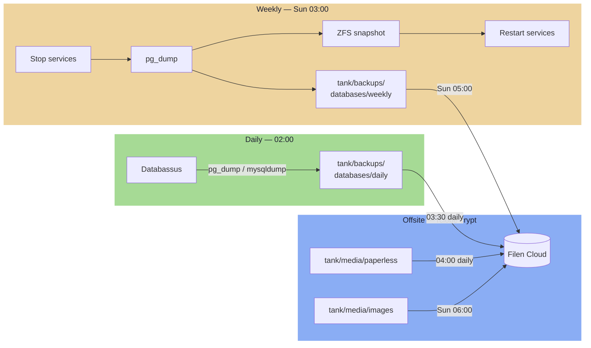

---
tags:
  - storage
  - backups
  - rclone
---

# Backups

### Backup Strategy Overview



=== "Daily — Databasus"

    Databasus runs as a Swarm service on Services VM. It connects to Postgres and MariaDB over TCP and writes dumps to `tank/backups/databases/daily/` (NFS-mounted into the container).

    - **Schedule:** 02:00 daily
    - **Retention:** 7 daily dumps
    - **Services stay running** throughout — no downtime

=== "Weekly — Coordinated shutdown"

    Runs every Sunday at 03:00 on Services VM. Stops services, dumps databases, snapshots file datasets, then restarts services.

    ```bash
    # 1. Stop Immich and Paperless
    docker service scale immich_server=0 immich_microservices=0
    docker service scale paperless_webserver=0 paperless_worker=0

    # 2. Dump databases
    pg_dump immich    > /mnt/backups/databases/weekly/immich_$(date +%F).sql
    pg_dump paperless > /mnt/backups/databases/weekly/paperless_$(date +%F).sql

    # 3. ZFS snapshots (instant — downtime = pg_dump duration only)
    ssh truenas "zfs snapshot tank/media/images@weekly-$(date +%F)"
    ssh truenas "zfs snapshot tank/media/paperless@weekly-$(date +%F)"

    # 4. Restart services
    docker service scale immich_server=1 immich_microservices=1
    docker service scale paperless_webserver=1 paperless_worker=1
    ```

    - **Retention:** 4 weekly SQL dumps; 4 ZFS snapshots per dataset
    - **Downtime:** ~1-3 minutes (pg_dump duration)

=== "Offsite — Filen"

    Double-layer encryption: Filen's own E2E encryption plus rclone client-side `crypt` remote.

    ```ini
    [filen]
    type = filen
    email = <filen-account-email>
    password = <filen-master-key>

    [filen-crypt]
    type = crypt
    remote = filen:homelab-backup
    filename_encryption = standard
    directory_name_encryption = true
    password = <rclone-crypt-password>    # stored in tank/backups/keys/
    password2 = <rclone-crypt-salt>       # stored in tank/backups/keys/
    ```

## Offsite Sync Schedule

| Time | Frequency | What |
|---|---|---|
| 03:30 | Daily | `tank/backups/keys/` + `tank/backups/databases/daily/` |
| 04:00 | Daily | `tank/media/paperless/` (incremental) |
| Sun 05:00 | Weekly | `tank/backups/databases/weekly/` + `tank/backups/services/` + `tank/repos/` |
| Sun 06:00 | Weekly | `tank/media/images/` (incremental photo sync) |

### Not Backed Up Offsite

| Dataset | Reason |
|---|---|
| `tank/media/series`, `movies`, `downloads` | Re-downloadable; too large for cloud quota |
| `tank/services/databases/` live dirs | Use dumps — never sync live DB dirs |
| `tank/backups/pbs/` | VM backups too large; PBS is local recovery path |
| `tank/pxe/` | ISOs are re-downloadable |
