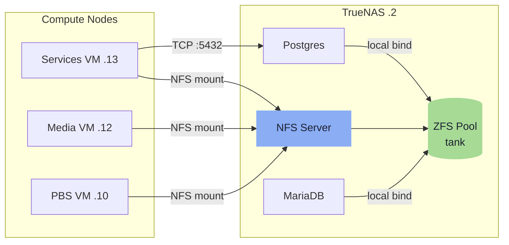

# S3 Retirement & SSO Migration Implementation Plan

> **For agentic workers:** REQUIRED SUB-SKILL: Use superpowers:subagent-driven-development (recommended) or superpowers:executing-plans to implement this plan task-by-task. Steps use checkbox (`- [ ]`) syntax for tracking.

**Goal:** Update all design files and published docs to reflect two decisions: MinIO/S3 retired in favour of a PostgreSQL OpenTofu state backend, and Authentik replaced by Zitadel as the identity provider (Authelia stays).

**Architecture:** Pure documentation change — no IaC files, Ansible playbooks, or Compose stacks are modified here. Design files (`design/`) and the MkDocs docs site (`docs/`) are brought into sync with the decisions recorded in the spec. CLAUDE.md key decisions table is updated last to close the loop.

**Tech Stack:** Markdown, MkDocs Material (Mermaid diagrams), CLAUDE.md

---

## Files Modified

| File | What changes |
|---|---|
| `design/storage.md` | Remove MinIO S3 section, `tank/s3/` dataset, snapshot task, reactive_resume row; update backup script (add `tofu_state` dump, remove step 4) |
| `design/iac-pipeline.md` | Swap backend.tf to `pg`; update backup script step 4 removal note; update credential rotation runbook |
| `design/sso.md` | Replace Authentik with Zitadel throughout; update components table, auth flows, ZFS note |
| `docs/stack/storage.md` | Remove S3/MinIO section; remove `tank/s3/` from tree; remove `tank/media/authentik` NFS row; remove reactive_resume row; update Mermaid diagram; update backup databases scope |
| `docs/stack/services.md` | Remove reactive-resume services and overlay; update auth overlay to Zitadel |
| `docs/automation/cicd.md` | Update runner access requirements (MinIO → Postgres for Tofu state) |
| `.claude/CLAUDE.md` | Update 10 key decisions rows; update IaC stack description |

---

## Task 1: Update `design/storage.md` — S3 retirement

**Files:**
- Modify: `design/storage.md`

- [ ] **Step 1: Remove the TrueNAS S3 (MinIO) section**

Find and delete the entire `### TrueNAS S3 (MinIO)` section (from the `### TrueNAS S3 (MinIO)` heading through the closing `STORAGE_USE_SSL=true` code block and the blank line after it). This removes ~30 lines describing the MinIO endpoint, buckets, and reactive_resume env vars.

- [ ] **Step 2: Remove `tank/s3/` from the ZFS dataset tree**

In the `### ZFS Dataset Tree` section, remove the line:

```
├── s3/                 recordsize=1M  · compression=lz4  · atime=off   ← MinIO data
```

- [ ] **Step 3: Remove `tank/s3/` quota entry**

In the `#### Dataset quotas` table, remove the row:

```
| `tank/s3/` | 100 GB | MinIO — reactive_resume files + Terraform state |
```

Also remove the reference to S3 from the total quota note below it (recalculate or simplify: "Total media quota: ~21.6 TB of ~24 TB usable").

- [ ] **Step 4: Remove `tank/s3/` from ZFS snapshot schedule**

In the `#### Automated ZFS snapshots` table, remove the row:

```
| `tank/s3/` | Daily | 03:05 | 7 daily |
```

- [ ] **Step 5: Remove reactive_resume from Docker Volume Strategy table**

In the `### Docker Volume Strategy` table, remove the row:

```
| reactive_resume files | TrueNAS S3 bucket | No SeaweedFS container needed |
```

- [ ] **Step 6: Update the backup script — add `tofu_state` dump, remove step 4**

In the `### Backup Strategy` section, find the backup script code block.

**Remove step 4 entirely:**
```bash
# 4. Pull Terraform state (via SSH to Services VM where tofu is installed)
ssh services "cd /home/void/Homelab/infra/terraform && tofu state pull" > "${SERVICES_DIR}/terraform-state.json"
```

**In step 3 (pg_dump block), add `tofu_state` after `freshrss`:**
```bash
pg_dump -h 127.0.0.1 tofu_state   > "${DUMP_DIR}/${DATE}-tofu_state.sql"
```

**Renumber** the remaining steps (old step 5 → new step 4, old step 6 → new step 5, etc.) so the comments stay sequential.

- [ ] **Step 7: Update the backup script code block — swap authentik for zitadel and tofu_state**

Inside the bash code block in `### Backup Strategy`, find:
```bash
pg_dump -h 127.0.0.1 authentik   > "${DUMP_DIR}/${DATE}-authentik.sql"
```
Replace with:
```bash
pg_dump -h 127.0.0.1 zitadel     > "${DUMP_DIR}/${DATE}-zitadel.sql"
pg_dump -h 127.0.0.1 tofu_state  > "${DUMP_DIR}/${DATE}-tofu_state.sql"
```

Also update the `Databases in scope` bullet below the script:

Change:
```
- **Databases in scope:** `immich`, `paperless`, `gitea`, `authentik`, `freshrss`
```
To:
```
- **Databases in scope:** `immich`, `paperless`, `gitea`, `zitadel`, `freshrss`, `tofu_state`
```

- [ ] **Step 8: Remove NFS export row for `tank/backups/services` Terraform state reference**

In the NFS exports table, the `tank/backups/services` row has the comment "Terraform state, container configs — synced offsite daily". Update the comment to remove the "Terraform state" part since state is now in Postgres:

Change the Notes column for `tank/backups/services` from:
```
Daily pg_dump output from backup script | Terraform state, container configs — synced offsite daily
```
To:
```
Container configs, TrueNAS config export — synced offsite daily
```

(The "Terraform state" entry under the offsite backup section in `### Backup Strategy` RPO/RTO table should also be updated: change "Daily state pull to `tank/backups/services/`" to "Daily `pg_dump tofu_state` to `tank/backups/databases/`".)

- [ ] **Step 9: Commit**

```bash
git add design/storage.md
git commit -m "design(storage): retire MinIO S3 and tank/s3 dataset"
```

---

## Task 2: Update `design/iac-pipeline.md` — pg backend and credential rotation

**Files:**
- Modify: `design/iac-pipeline.md`

- [ ] **Step 1: Swap the Terraform state backend from S3 to PostgreSQL**

Find the `### Terraform State Backend — TrueNAS MinIO` section. Replace the entire section heading and content with:

```markdown
### Terraform State Backend — PostgreSQL

State is stored in the `tofu_state` PostgreSQL database on TrueNAS (.2). OpenTofu's `pg` backend provides native state locking via PostgreSQL advisory locks — no DynamoDB equivalent required.

```hcl
# infra/terraform/backend.tf
terraform {
  backend "pg" {
    conn_str = "postgres://tofu@172.16.20.2/tofu_state"
  }
}
```

The connection string password is injected at runtime via the `PG_CONN_STR` environment variable, set by SOPS. The `tofu_state` database and `tofu` user are provisioned by Ansible. OpenTofu initialises its own schema on `tofu init`. State is backed up by the daily `pg_dump tofu_state` in the backup script — same 30-day retention as other databases.
```

- [ ] **Step 2: Remove step 4 from the backup script in iac-pipeline.md**

The backup script is also documented in `design/iac-pipeline.md`. Apply the same changes as Task 1 Step 6: remove the step 4 `tofu state pull` block, add `tofu_state` to the pg_dump block in step 3, and renumber the subsequent steps.

- [ ] **Step 3: Update the credential rotation runbook — remove MinIO keys**

In the credential rotation table, remove the MinIO row:

```
| 5 | **MinIO access/secret keys** | `secrets.sops.tfvars` + `secrets.sops.yml` | Create new key in MinIO console → ... |
```

Renumber subsequent rows (old 6 → new 5, old 7 → new 6, etc.).

- [ ] **Step 4: Update the credential rotation runbook — update Tofu backend entry**

There is no explicit "Tofu pg password" row yet. Add one after the Postgres passwords row (row 1):

```markdown
| 2 | **Tofu state DB password** (`tofu` user) | `secrets.sops.yml` | Generate new password → `sops edit` → `ALTER USER tofu PASSWORD '...'` on TrueNAS Postgres → update `PG_CONN_STR` in Ansible secrets → verify `tofu plan` works |
```

Renumber subsequent rows accordingly.

- [ ] **Step 5: Update the runner LXC description**

In the runner LXC section, change the access requirement from MinIO to Postgres:

Change:
```
the Proxmox API for OpenTofu dynamic inventory, and TrueNAS MinIO for OpenTofu state.
```
To:
```
the Proxmox API for OpenTofu dynamic inventory, and TrueNAS Postgres for OpenTofu state.
```

Also update the nftables firewall rule in the runner hardening table — change `MinIO (.2:9000)` to `Postgres (.2:5432)`.

- [ ] **Step 5b: Update the backup script code block in iac-pipeline.md**

Same as Task 1 Step 7 — the backup script is duplicated in `design/iac-pipeline.md`. Find:
```bash
pg_dump -h 127.0.0.1 authentik   > "${DUMP_DIR}/${DATE}-authentik.sql"
```
Replace with:
```bash
pg_dump -h 127.0.0.1 zitadel     > "${DUMP_DIR}/${DATE}-zitadel.sql"
pg_dump -h 127.0.0.1 tofu_state  > "${DUMP_DIR}/${DATE}-tofu_state.sql"
```

- [ ] **Step 5c: Update credential rotation — Authentik SECRET_KEY → Zitadel MASTERKEY**

In the credential rotation table, find the row:
```
| 14 | **Authentik SECRET_KEY** | `secrets.sops.yml` | ⚠ Invalidates all sessions. Generate new key → `sops edit` → Ansible redeploy Authentik → all users must re-authenticate |
```
Replace with:
```
| 14 | **Zitadel MASTERKEY** | `secrets.sops.yml` | ⚠ Invalidates all encrypted data at rest. Generate new 32-byte key → `sops edit` → Ansible redeploy Zitadel → verify console accessible |
```

- [ ] **Step 5d: Update credential rotation — Valkey passwords from ×2 to ×1**

Find the row:
```
| 6 | **Valkey passwords** (×2) | `secrets.sops.yml` | Generate new password → `sops edit` → Ansible redeploy Authentik + Authelia stacks (Valkey is ephemeral, no data migration) |
```
Replace with:
```
| 6 | **Valkey password** (authelia-valkey) | `secrets.sops.yml` | Generate new password → `sops edit` → Ansible redeploy Authelia stack (Valkey is ephemeral, no data migration) |
```

- [ ] **Step 6: Update the IaC stack description**

In the `## IaC Pipeline` section, the repository structure shows `backend.tf                # TrueNAS MinIO S3 state`. Change the comment to:

```
backend.tf                # TrueNAS PostgreSQL state
```

- [ ] **Step 7: Commit**

```bash
git add design/iac-pipeline.md
git commit -m "design(iac): switch OpenTofu backend from MinIO S3 to PostgreSQL"
```

---

## Task 3: Update `design/sso.md` — replace Authentik with Zitadel

**Files:**
- Modify: `design/sso.md`

- [ ] **Step 1: Update the header and introduction**

Replace the file header and intro paragraph:

Old:
```markdown
# SSO — Authentik & Authelia
...
Authentik is the single identity provider — all users, credentials, 2FA, and group membership are managed there. Authelia sits in front of Traefik as a forward auth middleware for services that have no native OIDC support, and authenticates back to Authentik via OIDC. There is no separate user database in Authelia.
```

New:
```markdown
# SSO — Zitadel & Authelia

**Source:** §12 of original homelab-design.md
**Last updated:** 2026-04-08

---

Zitadel is the single identity provider — all users, credentials, 2FA, and group membership are managed there. Authelia sits in front of Traefik as a forward auth middleware for services that have no native OIDC support, and authenticates back to Zitadel via OIDC. There is no separate user database in Authelia.
```

- [ ] **Step 2: Update the auth flows section**

Replace both flow diagrams. The flows themselves are identical in structure — only the provider name changes:

**Native OIDC:**
```
User hits app → app redirects to zitadel.blackcats.cc
→ User authenticates in Zitadel
→ Zitadel issues OIDC token → app validates → user is in
```

**Traefik forward auth:**
```
User hits app → Traefik calls Authelia middleware
→ Authelia redirects to Zitadel login
→ User authenticates in Zitadel
→ Authelia receives callback, sets session cookie → Traefik lets request through
```

Also update the closing note: replace "Whether an app uses native OIDC or forward auth is determined at service deployment time based on what the app supports." — this stays unchanged.

- [ ] **Step 3: Replace the components table**

Replace the entire `### Components` table with:

```markdown
### Components

All components run as Swarm services on Services VM (.13).

| Component | Detail |
|---|---|
| Zitadel server | `zitadel.blackcats.cc` via Traefik · TLS auto · single Go binary |
| Zitadel DB | Shared Postgres on TrueNAS (.2) · dedicated `zitadel` database |
| Authelia | Traefik forward auth middleware · OIDC client of Zitadel · no own user DB |
| authelia-valkey | Dedicated Valkey · session storage · ephemeral local volume on Services VM · `requirepass` (generated, in SOPS) |
| Authelia config | YAML managed by Ansible · no persistent data volume · OIDC client secret in SOPS |

> **Note — Zitadel has no sidecar cache or local volume.** It is a single Go container backed only by PostgreSQL. No Valkey instance required. This simplifies the `auth` overlay from 5 services (Authentik server, Authentik worker, authentik-valkey, Authelia, authelia-valkey) to 3 (Zitadel, Authelia, authelia-valkey).

> **Note — Zitadel data model.** Zitadel uses an instance → organization → project hierarchy. For this single-user homelab: one default instance, one organization, all OIDC applications under one project ("Homelab"). The `ZITADEL_MASTERKEY` (32 bytes, SOPS-managed) encrypts sensitive data at rest within Postgres.

> **Note — Authelia config change.** Only the OIDC provider block changes — `issuer_url` points to `https://zitadel.blackcats.cc` instead of Authentik. Access control rules, session config, and regulation are unchanged.

> **Note — Placement rationale.** A dedicated auth VM was considered but rejected: Traefik is pinned to Services VM, so forward auth always traverses Services VM regardless. Separating auth adds VM overhead without meaningful resilience gain.
```

- [ ] **Step 4: Replace the ZFS addition note**

Replace:
```markdown
### ZFS addition

Authentik media (branding, custom assets) uses a local named volume on Services VM — the data is minimal and recreatable. No NFS dataset required.

Authelia has no NFS dataset — config is in git, sessions in Valkey.
```

With:
```markdown
### ZFS addition

Neither Zitadel nor Authelia requires an NFS dataset. Zitadel stores all state in Postgres. Authelia config is in git, sessions in Valkey. The `tank/media/authentik` dataset used by the previous Authentik deployment is retired.
```

- [ ] **Step 5: Commit**

```bash
git add design/sso.md
git commit -m "design(sso): replace Authentik with Zitadel as identity provider"
```

---

## Task 4: Update `docs/stack/storage.md`

**Files:**
- Modify: `docs/stack/storage.md`

- [ ] **Step 1: Update the Mermaid data flow diagram**

Remove the `S3[MinIO S3]` node and the `SVC -->|TCP :9000| S3` and `S3 --> ZFS` edges. The updated diagram:



- [ ] **Step 2: Remove `tank/s3/` and `tank/media/authentik` from the ZFS dataset tree**

Remove from the tree block:
```
│   └── authentik       recordsize=128K · compression=zstd · atime=off
```
and:
```
├── s3/                 recordsize=1M  · compression=lz4  · atime=off   ← MinIO data
```

- [ ] **Step 3: Update the ZFS property rationale table**

Remove the row referencing S3:
```
| `compression=lz4` | Images, DB live, PBS, S3 | Near-zero CPU cost, moderate gain |
| `recordsize=1M` | Video, PBS, S3 | Large sequential reads/writes |
```
Update to:
```
| `compression=lz4` | Images, DB live, PBS | Near-zero CPU cost, moderate gain |
| `recordsize=1M` | Video, PBS | Large sequential reads/writes |
```

- [ ] **Step 4: Remove `tank/media/authentik` NFS export row**

In the `## NFS Exports` table, remove the row:
```
| `tank/media/authentik` | Services VM (.13) | `/mnt/media/authentik` |
```

- [ ] **Step 5: Update the Docker Volume Strategy table**

Remove the row:
```
| Authentik media | `tank/media/authentik` NFS | Custom assets, media uploads |
```
Remove the row:
```
| reactive_resume files | TrueNAS S3 bucket | No SeaweedFS container needed |
```

- [ ] **Step 6: Remove the `## S3 / MinIO` section entirely**

Delete from `## S3 / MinIO` through the end of the `reactive_resume Configuration` subsection (including the env var code block and the SeaweedFS note). This is roughly lines 161–193.

- [ ] **Step 7: Update backup databases scope in the backup description**

Find the bullet: `- **Databases in scope:** \`immich\`, \`paperless\`, \`gitea\`, \`authentik\`, \`freshrss\``

Change to: `- **Databases in scope:** \`immich\`, \`paperless\`, \`gitea\`, \`zitadel\`, \`freshrss\`, \`tofu_state\``

- [ ] **Step 8: Commit**

```bash
git add docs/stack/storage.md
git commit -m "docs(storage): remove MinIO/S3 and Authentik; update for Zitadel and pg Tofu state"
```

---

## Task 5: Update `docs/stack/services.md`

**Files:**
- Modify: `docs/stack/services.md`

- [ ] **Step 1: Update Services VM (.13) placement tab**

Replace the current Services VM service list:
```
Traefik, Paperless, paperless-broker (Valkey), Gotenberg, Tika, Immich, Immich ML (CPU), immich-valkey, reactive-resume, reactive-resume-browserless, Homebox, IT-Tools, Authentik, Authentik-worker, authentik-valkey, Authelia, authelia-valkey
```

With:
```
Traefik, Paperless, paperless-broker (Valkey), Gotenberg, Tika, Immich, Immich ML (CPU), immich-valkey, Homebox, IT-Tools, FreshRSS, Gitea, Zitadel, Authelia, authelia-valkey
```

(reactive-resume and reactive-resume-browserless removed; Authentik server, Authentik-worker, authentik-valkey replaced by Zitadel)

- [ ] **Step 2: Update the overlay networks table**

Remove the `reactive-resume` overlay row:
```
| `reactive-resume` | reactive-resume, browserless | Resume builder |
```

Update the `auth` overlay row:
```
| `auth` | Zitadel, Authelia, authelia-valkey | SSO components |
```

- [ ] **Step 3: Commit**

```bash
git add docs/stack/services.md
git commit -m "docs(services): remove reactive-resume; replace Authentik with Zitadel"
```

---

## Task 6: Update `docs/automation/cicd.md`

**Files:**
- Modify: `docs/automation/cicd.md`

- [ ] **Step 1: Update the runner access requirements note**

Find:
```
The runner LXC requires broad network access: SSH to all homelab hosts for Ansible, the Proxmox API for OpenTofu dynamic inventory, and TrueNAS MinIO for OpenTofu state.
```

Replace with:
```
The runner LXC requires broad network access: SSH to all homelab hosts for Ansible, the Proxmox API for OpenTofu dynamic inventory, and TrueNAS Postgres for OpenTofu state.
```

- [ ] **Step 2: Commit**

```bash
git add docs/automation/cicd.md
git commit -m "docs(cicd): update runner access — MinIO replaced by Postgres for Tofu state"
```

---

## Task 7: Update `.claude/CLAUDE.md` key decisions

**Files:**
- Modify: `.claude/CLAUDE.md`

- [ ] **Step 1: Update SeaweedFS entry**

Change:
```
| SeaweedFS | Eliminated — reactive_resume uses TrueNAS MinIO S3 (truenas.blackcats.cc:9000) |
```
To:
```
| SeaweedFS | Eliminated — reactive_resume also removed from stack; no S3 consumer remains |
```

- [ ] **Step 2: Update DB backup scope entry**

Change:
```
| DB backup scope | Databases in scope: immich, paperless, gitea, authentik, freshrss — all on TrueNAS Postgres; 30-day retention in tank/backups/databases/ |
```
To:
```
| DB backup scope | Databases in scope: immich, paperless, gitea, zitadel, freshrss, tofu_state — all on TrueNAS Postgres; 30-day retention in tank/backups/databases/ |
```

- [ ] **Step 3: Remove the `reactive_resume DB` entry**

Remove the row:
```
| reactive_resume DB | Consolidated into shared TrueNAS Postgres |
```
(reactive_resume is no longer in the stack)

- [ ] **Step 4: Update SSO provider entry**

Change:
```
| SSO provider | Authentik — single user store, manages all credentials and 2FA |
```
To:
```
| SSO provider | Zitadel — single user store, manages all credentials and 2FA; Go binary backed by Postgres only |
```

- [ ] **Step 5: Update SSO forward auth entry**

Change:
```
| SSO forward auth | Authelia as Traefik middleware; authenticates against Authentik via OIDC; no own user DB |
```
To:
```
| SSO forward auth | Authelia as Traefik middleware; authenticates against Zitadel via OIDC; no own user DB |
```

- [ ] **Step 6: Update SSO native OIDC entry**

Change:
```
| SSO native OIDC | Apps with native support connect directly to Authentik; determined per-service at deployment |
```
To:
```
| SSO native OIDC | Apps with native support connect directly to Zitadel; determined per-service at deployment |
```

- [ ] **Step 7: Update SSO placement entry**

Change:
```
| SSO placement | Authentik + Authelia both on Services VM (.13); dedicated Valkey per component |
```
To:
```
| SSO placement | Zitadel + Authelia both on Services VM (.13); dedicated Valkey for Authelia only (Zitadel needs none) |
```

- [ ] **Step 8: Remove the Authentik data entry**

Remove the row:
```
| Authentik data | Local named volume on Services VM (.13) — minimal branding assets, recreatable; dedicated `authentik` Postgres DB on TrueNAS |
```

- [ ] **Step 9: Update SSO rate limiting entry**

Change:
```
| SSO rate limiting | Traefik rateLimit middleware on Authentik/Authelia login endpoints; Authentik built-in lockout; Authelia regulation (max_retries, ban_time) |
```
To:
```
| SSO rate limiting | Traefik rateLimit middleware on Zitadel/Authelia login endpoints; Zitadel built-in lockout; Authelia regulation (max_retries, ban_time) |
```

- [ ] **Step 10: Update Tofu state entry**

Change:
```
| Tofu state | Stored in MinIO on TrueNAS but NOT treated as critical — if lost, run `tofu apply` fresh; Tofu creates new resources from IaC definitions |
```
To:
```
| Tofu state | Stored in PostgreSQL on TrueNAS (`tofu_state` database); backed up daily by pg_dump alongside other databases; if lost, run `tofu apply` fresh |
```

- [ ] **Step 11: Remove MinIO TLS entry**

Remove the row:
```
| MinIO TLS | Always connect by hostname (truenas.blackcats.cc:9000), never IP — cert is issued for hostname; IP access bypasses TLS validation |
```

- [ ] **Step 12: Update the IaC stack description**

Change:
```
- **OpenTofu** — VM provisioning + DNS records; state in TrueNAS MinIO S3 (`terraform-state` bucket)
```
To:
```
- **OpenTofu** — VM provisioning + DNS records; state in TrueNAS PostgreSQL (`tofu_state` database)
```

- [ ] **Step 13: Update the Services VM description in the IP map comment**

Change:
```
172.16.20.13  Services VM           — Swarm MANAGER, Traefik/Paperless/Immich/Gitea/Authentik/Authelia/etc.
```
To:
```
172.16.20.13  Services VM           — Swarm MANAGER, Traefik/Paperless/Immich/Gitea/Zitadel/Authelia/etc.
```

- [ ] **Step 14: Commit**

```bash
git add .claude/CLAUDE.md
git commit -m "docs(claude-md): update key decisions for S3 retirement and Authentik→Zitadel"
```
